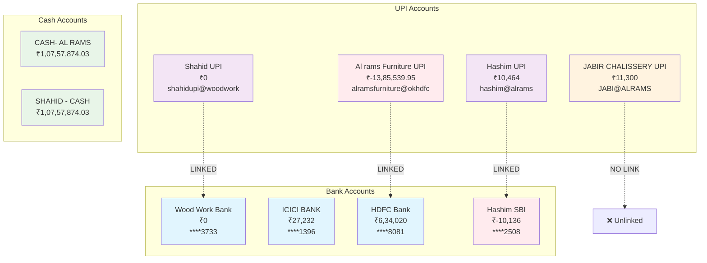

## 🔗 **Connection Mapping:**

| UPI Account | Bank Connection | Status | Balance Sync |
|-------------|----------------|--------|--------------|
| Al rams Furniture | ↔️ HDFC Bank | ⚠️ Mismatch | UPI: ₹-13.85L vs Bank: ₹6.34L |
| Hashim UPI | ↔️ Hashim SBI | ⚠️ Both Negative | UPI: ₹10K vs Bank: ₹-10K |
| Shahid UPI | ↔️ Wood Work | ✅ Synced | Both: ₹0 |
| JABIR CHALISSERY | ❌ No Link | ⚠️ Standalone | ₹11,300 (risky) |

## 📊 **Balance Analysis:**

### Positive Balances:
- ICICI BANK: ₹27,232 ✅
- HDFC: ₹6,34,020 ✅
- Hashim UPI: ₹10,464 ✅
- JABIR UPI: ₹11,300 ✅
- Cash Accounts: ₹21,51,574.06 total ✅

### Negative Balances:
- Hashim SBI: ₹-10,136 ⚠️
- Al rams Furniture UPI: ₹-13,85,539.95 ❌

### Net Position: ₹-7,12,660 (negative due to large UPI deficit)