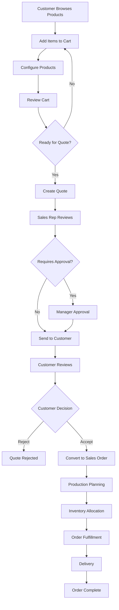
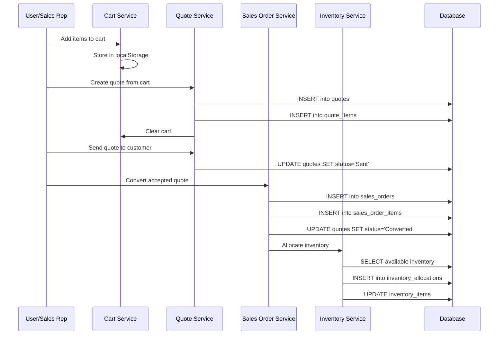

# Cart to Quote to Sales Order - Complete Reference Guide

## 📋 Table of Contents
1. [Overview](#overview)
2. [Database Schema Reference](#database-schema-reference)
3. [Workflow Architecture](#workflow-architecture)
4. [Cart Management](#cart-management)
5. [Quote Creation Process](#quote-creation-process)
6. [Quote to Sales Order Conversion](#quote-to-sales-order-conversion)
7. [Data Flow Diagrams](#data-flow-diagrams)
8. [Implementation Code Reference](#implementation-code-reference)
9. [Business Rules & Validations](#business-rules--validations)
10. [Error Handling & Edge Cases](#error-handling--edge-cases)
11. [API Endpoints Reference](#api-endpoints-reference)
12. [Testing Guidelines](#testing-guidelines)

---

## 1. Overview

### Business Process Flow
The Cart → Quote → Sales Order workflow represents the core sales funnel in the Al Rams ERP system:

```
🛒 Cart Management → 📋 Quote Creation → 💼 Sales Order → 🚚 Delivery
     (Temporary)         (Formal)         (Confirmed)      (Execution)
```

### Key Stakeholders
- **Customer**: Selects products and configurations
- **Sales Representative**: Creates quotes and manages customer relationships
- **Sales Manager**: Approves quotes and monitors sales performance
- **Warehouse Team**: Fulfills orders and manages inventory
- **Finance Team**: Handles pricing, discounts, and payment terms

---

## 2. Database Schema Reference

### 2.1 Core Tables Overview

#### Cart System (Temporary Storage)
```sql
-- Local storage or temporary session data
-- Not persisted in database permanently
LocalCart {
  items: CartItem[]
  customer_id?: string
  sales_rep_id?: string
  session_id: string
  created_at: timestamp
  updated_at: timestamp
}

CartItem {
  id: string
  product_id?: string
  custom_product_id?: string
  name: string
  quantity: number
  unit_price: number
  configuration?: object
  supplier_id?: string
  supplier_name?: string
  image_url?: string
  notes?: string
}
```

#### Quotes Table
```sql
CREATE TABLE quotes (
  -- Primary Information
  id uuid PRIMARY KEY DEFAULT gen_random_uuid(),
  quote_number text UNIQUE NOT NULL,
  customer_id uuid REFERENCES customers(id) NOT NULL,
  
  -- Status & Workflow
  status text DEFAULT 'Draft' CHECK (status IN ('Draft', 'Sent', 'Accepted', 'Rejected', 'Expired', 'Converted')),
  valid_until date,
  
  -- Pricing Information
  subtotal numeric DEFAULT 0,
  original_price numeric DEFAULT 0,
  discount_amount numeric DEFAULT 0,
  discount_percentage numeric DEFAULT 0,
  tax_amount numeric DEFAULT 0,
  freight_charges numeric DEFAULT 0,
  total_price numeric NOT NULL,
  final_price numeric NOT NULL,
  
  -- Financial Options
  emi_enabled boolean DEFAULT false,
  emi_plan jsonb DEFAULT '{}',
  emi_monthly numeric DEFAULT 0,
  bajaj_finance_amount numeric DEFAULT 0,
  
  -- Customer Information
  billing_address text,
  shipping_address text,
  customer_notes text,
  internal_notes text,
  
  -- Sales Information
  sales_representative_id uuid REFERENCES users(id),
  probability_percentage integer DEFAULT 0,
  expected_close_date date,
  
  -- Metadata
  created_by uuid REFERENCES users(id) NOT NULL,
  approved_by uuid REFERENCES users(id),
  created_at timestamp DEFAULT now(),
  updated_at timestamp DEFAULT now(),
  
  -- Audit & Tracking
  revision_number integer DEFAULT 1,
  parent_quote_id uuid REFERENCES quotes(id),
  conversion_date timestamp,
  is_deleted boolean DEFAULT false
);

-- Indexes for performance
CREATE INDEX idx_quotes_customer_id ON quotes(customer_id);
CREATE INDEX idx_quotes_sales_rep ON quotes(sales_representative_id);
CREATE INDEX idx_quotes_status ON quotes(status);
CREATE INDEX idx_quotes_created_at ON quotes(created_at);
```

#### Quote Items Table
```sql
CREATE TABLE quote_items (
  -- Primary Information
  id uuid PRIMARY KEY DEFAULT gen_random_uuid(),
  quote_id uuid REFERENCES quotes(id) ON DELETE CASCADE NOT NULL,
  line_number integer NOT NULL,
  
  -- Product Information
  product_id uuid REFERENCES products(id),
  custom_product_id uuid REFERENCES custom_products(id),
  name text NOT NULL,
  description text,
  sku text,
  category text,
  
  -- Pricing & Quantity
  quantity integer NOT NULL CHECK (quantity > 0),
  unit_price numeric NOT NULL CHECK (unit_price >= 0),
  cost_price numeric DEFAULT 0,
  discount_percentage numeric DEFAULT 0 CHECK (discount_percentage >= 0 AND discount_percentage <= 100),
  discount_amount numeric DEFAULT 0,
  line_total numeric GENERATED ALWAYS AS (quantity * unit_price * (1 - discount_percentage / 100) - discount_amount) STORED,
  
  -- Product Configuration
  configuration jsonb DEFAULT '{}',
  specifications text,
  finish_type text,
  material text,
  dimensions text,
  color text,
  
  -- Supplier Information
  supplier_id uuid REFERENCES suppliers(id),
  supplier_name text,
  supplier_part_number text,
  lead_time_days integer DEFAULT 0,
  
  -- Media & Documentation
  image_url text,
  technical_drawing_url text,
  
  -- Delivery Information
  delivery_timeline text,
  special_instructions text,
  
  -- Metadata
  created_at timestamp DEFAULT now(),
  updated_at timestamp DEFAULT now(),
  
  CONSTRAINT quote_items_product_check CHECK (
    (product_id IS NOT NULL AND custom_product_id IS NULL) OR 
    (product_id IS NULL AND custom_product_id IS NOT NULL)
  )
);

-- Ensure line numbers are sequential within a quote
CREATE UNIQUE INDEX idx_quote_items_quote_line ON quote_items(quote_id, line_number);
```

#### Sales Orders Table
```sql
CREATE TABLE sales_orders (
  -- Primary Information
  id uuid PRIMARY KEY DEFAULT gen_random_uuid(),
  order_number text UNIQUE NOT NULL,
  quote_id uuid REFERENCES quotes(id),
  customer_id uuid REFERENCES customers(id) NOT NULL,
  
  -- Status & Workflow
  status sales_order_status DEFAULT 'draft' CHECK (status IN (
    'draft', 'pending_approval', 'approved', 'in_production', 
    'ready_to_ship', 'shipped', 'delivered', 'completed', 
    'cancelled', 'on_hold'
  )),
  
  -- Pricing Information (Inherited from Quote)
  subtotal numeric DEFAULT 0,
  original_price numeric DEFAULT 0,
  discount_amount numeric DEFAULT 0,
  discount_percentage numeric DEFAULT 0,
  tax_amount numeric DEFAULT 0,
  freight_charges numeric DEFAULT 0,
  total_price numeric NOT NULL,
  final_price numeric NOT NULL,
  
  -- Financial Options (Inherited from Quote)
  emi_enabled boolean DEFAULT false,
  emi_plan jsonb DEFAULT '{}',
  emi_monthly numeric DEFAULT 0,
  bajaj_finance_amount numeric DEFAULT 0,
  
  -- Order Specific Information
  po_number text, -- Customer's Purchase Order Number
  payment_terms text DEFAULT 'Net 30',
  payment_status text DEFAULT 'pending' CHECK (payment_status IN ('pending', 'partial', 'paid', 'overdue')),
  
  -- Delivery Information
  billing_address text NOT NULL,
  shipping_address text NOT NULL,
  expected_delivery_date date,
  actual_delivery_date date,
  delivery_method text DEFAULT 'standard',
  tracking_number text,
  
  -- Customer Information
  customer_notes text,
  internal_notes text,
  special_instructions text,
  
  -- Sales Information
  sales_representative_id uuid REFERENCES users(id) NOT NULL,
  sales_manager_id uuid REFERENCES users(id),
  
  -- Production Information
  production_start_date date,
  production_completion_date date,
  quality_check_status text DEFAULT 'pending',
  
  -- Metadata
  created_by uuid REFERENCES users(id) NOT NULL,
  approved_by uuid REFERENCES users(id),
  created_at timestamp DEFAULT now(),
  updated_at timestamp DEFAULT now(),
  
  -- Audit & Compliance
  terms_accepted boolean DEFAULT false,
  terms_accepted_at timestamp,
  terms_accepted_by text, -- Customer name/signature
  contract_signed boolean DEFAULT false,
  contract_url text,
  
  -- Financial Tracking
  commission_percentage numeric DEFAULT 0,
  commission_amount numeric DEFAULT 0,
  margin_percentage numeric DEFAULT 0,
  margin_amount numeric DEFAULT 0,
  
  is_deleted boolean DEFAULT false
);

-- Indexes for performance
CREATE INDEX idx_sales_orders_customer_id ON sales_orders(customer_id);
CREATE INDEX idx_sales_orders_quote_id ON sales_orders(quote_id);
CREATE INDEX idx_sales_orders_sales_rep ON sales_orders(sales_representative_id);
CREATE INDEX idx_sales_orders_status ON sales_orders(status);
CREATE INDEX idx_sales_orders_created_at ON sales_orders(created_at);
```

#### Sales Order Items Table
```sql
CREATE TABLE sales_order_items (
  -- Primary Information
  id uuid PRIMARY KEY DEFAULT gen_random_uuid(),
  order_id uuid REFERENCES sales_orders(id) ON DELETE CASCADE NOT NULL,
  quote_item_id uuid REFERENCES quote_items(id),
  line_number integer NOT NULL,
  
  -- Product Information (Inherited from Quote Item)
  product_id uuid REFERENCES products(id),
  custom_product_id uuid REFERENCES custom_products(id),
  name text NOT NULL,
  description text,
  sku text,
  category text,
  
  -- Pricing & Quantity (Final from Quote)
  quantity integer NOT NULL CHECK (quantity > 0),
  unit_price numeric NOT NULL CHECK (unit_price >= 0),
  cost_price numeric DEFAULT 0,
  discount_percentage numeric DEFAULT 0,
  discount_amount numeric DEFAULT 0,
  final_price numeric NOT NULL,
  line_total numeric GENERATED ALWAYS AS (quantity * final_price) STORED,
  
  -- Product Configuration (Finalized)
  configuration jsonb DEFAULT '{}',
  specifications text,
  finish_type text,
  material text,
  dimensions text,
  color text,
  
  -- Supplier Information (Confirmed)
  supplier_id uuid REFERENCES suppliers(id),
  supplier_name text,
  supplier_part_number text,
  supplier_order_number text,
  
  -- Production Information
  production_status text DEFAULT 'pending' CHECK (production_status IN (
    'pending', 'in_queue', 'in_production', 'quality_check', 'completed', 'on_hold'
  )),
  production_start_date date,
  production_completion_date date,
  quality_approved boolean DEFAULT false,
  quality_notes text,
  
  -- Inventory & Fulfillment
  inventory_allocated boolean DEFAULT false,
  inventory_allocation_date timestamp,
  picked_quantity integer DEFAULT 0,
  shipped_quantity integer DEFAULT 0,
  delivered_quantity integer DEFAULT 0,
  
  -- Delivery Information
  delivery_timeline text,
  special_instructions text,
  packaging_requirements text,
  
  -- Media & Documentation
  image_url text,
  technical_drawing_url text,
  production_photos jsonb DEFAULT '[]',
  
  -- Financial Tracking
  commission_applicable boolean DEFAULT true,
  margin_amount numeric DEFAULT 0,
  
  -- Metadata
  created_at timestamp DEFAULT now(),
  updated_at timestamp DEFAULT now(),
  
  CONSTRAINT sales_order_items_product_check CHECK (
    (product_id IS NOT NULL AND custom_product_id IS NULL) OR 
    (product_id IS NULL AND custom_product_id IS NOT NULL)
  )
);

-- Ensure line numbers are sequential within an order
CREATE UNIQUE INDEX idx_sales_order_items_order_line ON sales_order_items(order_id, line_number);
```

### 2.2 Supporting Tables

#### Custom Products Table
```sql
CREATE TABLE custom_products (
  id uuid PRIMARY KEY DEFAULT gen_random_uuid(),
  name text NOT NULL,
  description text,
  base_price numeric DEFAULT 0,
  configuration_schema jsonb DEFAULT '{}',
  category text,
  subcategory text,
  material text,
  finish_options text[],
  color_options text[],
  size_options text[],
  lead_time_days integer DEFAULT 30,
  image_url text,
  technical_specifications text,
  created_by uuid REFERENCES users(id),
  created_at timestamp DEFAULT now(),
  is_active boolean DEFAULT true
);
```

#### Quote Revisions Table
```sql
CREATE TABLE quote_revisions (
  id uuid PRIMARY KEY DEFAULT gen_random_uuid(),
  quote_id uuid REFERENCES quotes(id) NOT NULL,
  revision_number integer NOT NULL,
  changes_summary text,
  previous_total numeric,
  new_total numeric,
  revised_by uuid REFERENCES users(id),
  revision_date timestamp DEFAULT now(),
  revision_reason text
);
```

#### Quote Approvals Table
```sql
CREATE TABLE quote_approvals (
  id uuid PRIMARY KEY DEFAULT gen_random_uuid(),
  quote_id uuid REFERENCES quotes(id) NOT NULL,
  approval_level integer NOT NULL, -- 1: Sales Manager, 2: Regional Manager, 3: VP Sales
  required_for_amount numeric,
  approver_id uuid REFERENCES users(id),
  approval_status text DEFAULT 'pending' CHECK (approval_status IN ('pending', 'approved', 'rejected')),
  approval_date timestamp,
  approval_notes text,
  created_at timestamp DEFAULT now()
);
```

---

## 3. Workflow Architecture

### 3.1 State Transitions

#### Cart States
```typescript
enum CartState {
  EMPTY = 'empty',
  ADDING_ITEMS = 'adding_items',
  READY_FOR_QUOTE = 'ready_for_quote',
  PROCESSING = 'processing'
}
```

#### Quote States
```typescript
enum QuoteStatus {
  DRAFT = 'Draft',              // Being created/edited
  PENDING_APPROVAL = 'Pending_Approval', // Requires management approval
  SENT = 'Sent',                // Sent to customer
  ACCEPTED = 'Accepted',        // Customer accepted
  REJECTED = 'Rejected',        // Customer rejected
  EXPIRED = 'Expired',          // Past valid_until date
  CONVERTED = 'Converted',      // Converted to sales order
  CANCELLED = 'Cancelled'       // Cancelled internally
}
```

#### Sales Order States
```typescript
enum SalesOrderStatus {
  DRAFT = 'draft',                    // Initial creation
  PENDING_APPROVAL = 'pending_approval', // Requires approval
  APPROVED = 'approved',              // Approved and ready for production
  IN_PRODUCTION = 'in_production',    // Items being manufactured
  READY_TO_SHIP = 'ready_to_ship',    // Production complete, ready for delivery
  SHIPPED = 'shipped',                // In transit to customer
  DELIVERED = 'delivered',            // Delivered to customer
  COMPLETED = 'completed',            // Fully fulfilled and closed
  CANCELLED = 'cancelled',            // Cancelled
  ON_HOLD = 'on_hold'                // Temporarily suspended
}
```

### 3.2 Business Rules Matrix

| Action | Cart | Quote | Sales Order | Conditions | Validations |
|--------|------|-------|-------------|------------|-------------|
| Add Item | ✅ | ❌ | ❌ | - | Stock availability, pricing |
| Modify Item | ✅ | ✅ (Draft only) | ❌ | Quote not sent | Valid configurations |
| Remove Item | ✅ | ✅ (Draft only) | ❌ | Quote not sent | Minimum order requirements |
| Create Quote | ✅ | - | ❌ | Cart not empty | Customer selected, valid items |
| Send Quote | ❌ | ✅ | ❌ | Quote approved | All prices confirmed |
| Accept Quote | ❌ | ✅ | - | Quote sent | Valid until date not passed |
| Convert to Order | ❌ | ✅ | - | Quote accepted | Payment terms agreed |
| Modify Order | ❌ | ❌ | ✅ (Limited) | Before production | Management approval |
| Cancel Order | ❌ | ❌ | ✅ | Before shipping | Customer agreement |

---

## 4. Cart Management

### 4.1 Cart Data Structure

#### Local Storage Implementation
```typescript
interface Cart {
  id: string;
  customer_id?: string;
  sales_rep_id: string;
  items: CartItem[];
  metadata: {
    session_id: string;
    created_at: string;
    updated_at: string;
    expires_at: string;
    device_id: string;
  };
  totals: CartTotals;
}

interface CartItem {
  id: string;
  type: 'product' | 'custom_product';
  product_id?: string;
  custom_product_id?: string;
  name: string;
  description?: string;
  sku?: string;
  
  // Quantity & Pricing
  quantity: number;
  unit_price: number;
  cost_price?: number;
  discount_percentage: number;
  discount_amount: number;
  line_total: number;
  
  // Configuration
  configuration?: Record<string, any>;
  specifications?: string;
  finish_type?: string;
  material?: string;
  dimensions?: string;
  color?: string;
  
  // Supplier Information
  supplier_id?: string;
  supplier_name?: string;
  lead_time_days?: number;
  
  // Media
  image_url?: string;
  
  // Notes
  notes?: string;
  internal_notes?: string;
  
  // Metadata
  added_at: string;
  updated_at: string;
}

interface CartTotals {
  subtotal: number;
  discount_amount: number;
  tax_amount: number;
  freight_estimate: number;
  total: number;
  items_count: number;
}
```

### 4.2 Cart Operations

#### Add Item to Cart
```typescript
export class CartService {
  static async addItem(cartItem: Omit<CartItem, 'id' | 'added_at' | 'updated_at'>): Promise<CartItem> {
    const cart = await this.getCart();
    
    // Validate item
    await this.validateCartItem(cartItem);
    
    // Check for existing item (same product + configuration)
    const existingItem = this.findExistingItem(cart.items, cartItem);
    
    if (existingItem) {
      // Update quantity of existing item
      return this.updateItemQuantity(existingItem.id, existingItem.quantity + cartItem.quantity);
    } else {
      // Add new item
      const newItem: CartItem = {
        ...cartItem,
        id: generateUniqueId(),
        line_total: this.calculateLineTotal(cartItem),
        added_at: new Date().toISOString(),
        updated_at: new Date().toISOString()
      };
      
      cart.items.push(newItem);
      cart.totals = this.calculateCartTotals(cart.items);
      cart.metadata.updated_at = new Date().toISOString();
      
      await this.saveCart(cart);
      return newItem;
    }
  }

  static async updateItemQuantity(itemId: string, newQuantity: number): Promise<CartItem> {
    const cart = await this.getCart();
    const item = cart.items.find(i => i.id === itemId);
    
    if (!item) {
      throw new Error('Cart item not found');
    }
    
    if (newQuantity <= 0) {
      return this.removeItem(itemId);
    }
    
    // Validate new quantity
    await this.validateQuantity(item, newQuantity);
    
    item.quantity = newQuantity;
    item.line_total = this.calculateLineTotal(item);
    item.updated_at = new Date().toISOString();
    
    cart.totals = this.calculateCartTotals(cart.items);
    cart.metadata.updated_at = new Date().toISOString();
    
    await this.saveCart(cart);
    return item;
  }

  static async removeItem(itemId: string): Promise<void> {
    const cart = await this.getCart();
    cart.items = cart.items.filter(item => item.id !== itemId);
    cart.totals = this.calculateCartTotals(cart.items);
    cart.metadata.updated_at = new Date().toISOString();
    
    await this.saveCart(cart);
  }

  static async clearCart(): Promise<void> {
    const cart = await this.getCart();
    cart.items = [];
    cart.totals = this.calculateCartTotals([]);
    cart.metadata.updated_at = new Date().toISOString();
    
    await this.saveCart(cart);
  }

  private static findExistingItem(items: CartItem[], newItem: CartItem): CartItem | undefined {
    return items.find(item => 
      item.product_id === newItem.product_id &&
      item.custom_product_id === newItem.custom_product_id &&
      JSON.stringify(item.configuration) === JSON.stringify(newItem.configuration)
    );
  }

  private static calculateLineTotal(item: CartItem): number {
    const baseTotal = item.quantity * item.unit_price;
    const discountAmount = (baseTotal * item.discount_percentage / 100) + item.discount_amount;
    return Math.max(0, baseTotal - discountAmount);
  }

  private static calculateCartTotals(items: CartItem[]): CartTotals {
    const subtotal = items.reduce((sum, item) => sum + item.line_total, 0);
    const discount_amount = items.reduce((sum, item) => 
      sum + (item.quantity * item.unit_price * item.discount_percentage / 100) + item.discount_amount, 0);
    const tax_amount = subtotal * 0.18; // 18% GST
    const freight_estimate = subtotal > 50000 ? 0 : 2000; // Free freight above 50k
    const total = subtotal + tax_amount + freight_estimate;
    
    return {
      subtotal,
      discount_amount,
      tax_amount,
      freight_estimate,
      total,
      items_count: items.length
    };
  }
}
```

---

## 5. Quote Creation Process

### 5.1 Quote Generation Workflow

#### Step 1: Quote Header Creation
```typescript
interface CreateQuoteRequest {
  customer_id: string;
  sales_representative_id: string;
  cart_items: CartItem[];
  quote_details: {
    valid_until?: Date;
    billing_address?: string;
    shipping_address?: string;
    customer_notes?: string;
    internal_notes?: string;
    probability_percentage?: number;
    expected_close_date?: Date;
  };
  pricing_options: {
    discount_percentage?: number;
    discount_amount?: number;
    freight_charges?: number;
    emi_enabled?: boolean;
    emi_plan?: EMIPlan;
  };
}

export class QuoteService {
  static async createQuoteFromCart(request: CreateQuoteRequest): Promise<Quote> {
    // Validate request
    await this.validateQuoteRequest(request);
    
    // Generate quote number
    const quoteNumber = await this.generateQuoteNumber();
    
    // Calculate totals
    const totals = this.calculateQuoteTotals(request.cart_items, request.pricing_options);
    
    // Create quote record
    const quote = await this.createQuoteRecord({
      quote_number: quoteNumber,
      customer_id: request.customer_id,
      sales_representative_id: request.sales_representative_id,
      ...request.quote_details,
      ...totals,
      status: 'Draft',
      created_by: request.sales_representative_id
    });
    
    // Create quote items
    await this.createQuoteItems(quote.id, request.cart_items);
    
    // Check if approval required
    if (await this.requiresApproval(quote)) {
      await this.createApprovalRequest(quote.id, totals.final_price);
    }
    
    // Clear cart after successful quote creation
    await CartService.clearCart();
    
    return quote;
  }

  private static async createQuoteRecord(quoteData: QuoteCreateData): Promise<Quote> {
    const { data, error } = await supabase
      .from('quotes')
      .insert({
        ...quoteData,
        created_at: new Date().toISOString(),
        updated_at: new Date().toISOString()
      })
      .select()
      .single();

    if (error) {
      console.error('Failed to create quote:', error);
      throw new Error('Failed to create quote');
    }

    return data;
  }

  private static async createQuoteItems(quoteId: string, cartItems: CartItem[]): Promise<void> {
    const quoteItems = cartItems.map((item, index) => ({
      quote_id: quoteId,
      line_number: index + 1,
      product_id: item.product_id,
      custom_product_id: item.custom_product_id,
      name: item.name,
      description: item.description,
      sku: item.sku,
      quantity: item.quantity,
      unit_price: item.unit_price,
      cost_price: item.cost_price || 0,
      discount_percentage: item.discount_percentage,
      discount_amount: item.discount_amount,
      configuration: item.configuration || {},
      specifications: item.specifications,
      finish_type: item.finish_type,
      material: item.material,
      dimensions: item.dimensions,
      color: item.color,
      supplier_id: item.supplier_id,
      supplier_name: item.supplier_name,
      lead_time_days: item.lead_time_days || 0,
      image_url: item.image_url,
      delivery_timeline: item.lead_time_days ? `${item.lead_time_days} days` : undefined,
      special_instructions: item.notes
    }));

    const { error } = await supabase
      .from('quote_items')
      .insert(quoteItems);

    if (error) {
      console.error('Failed to create quote items:', error);
      throw new Error('Failed to create quote items');
    }
  }

  private static calculateQuoteTotals(
    cartItems: CartItem[], 
    pricingOptions: CreateQuoteRequest['pricing_options']
  ): QuoteTotals {
    const subtotal = cartItems.reduce((sum, item) => sum + item.line_total, 0);
    
    const additional_discount_amount = pricingOptions.discount_amount || 0;
    const additional_discount_percentage = pricingOptions.discount_percentage || 0;
    const additional_discount = (subtotal * additional_discount_percentage / 100) + additional_discount_amount;
    
    const original_price = subtotal;
    const discount_amount = additional_discount;
    const freight_charges = pricingOptions.freight_charges || (subtotal > 50000 ? 0 : 2000);
    const tax_amount = (subtotal - discount_amount) * 0.18; // 18% GST
    const total_price = subtotal - discount_amount + tax_amount + freight_charges;
    const final_price = pricingOptions.emi_enabled ? 
      pricingOptions.emi_plan?.total_amount || total_price : total_price;

    return {
      subtotal,
      original_price,
      discount_amount,
      discount_percentage: additional_discount_percentage,
      tax_amount,
      freight_charges,
      total_price,
      final_price,
      emi_enabled: pricingOptions.emi_enabled || false,
      emi_plan: pricingOptions.emi_plan || {},
      emi_monthly: pricingOptions.emi_plan?.monthly_amount || 0,
      bajaj_finance_amount: pricingOptions.emi_enabled ? 
        pricingOptions.emi_plan?.total_amount || 0 : 0
    };
  }
}
```

### 5.2 Quote Approval Process

#### Approval Rules Engine
```typescript
interface ApprovalRule {
  level: number;
  condition: (quote: Quote) => boolean;
  approver_roles: string[];
  required_for_amount?: number;
  required_for_discount_percentage?: number;
}

const APPROVAL_RULES: ApprovalRule[] = [
  {
    level: 1,
    condition: (quote) => quote.final_price > 100000 || quote.discount_percentage > 10,
    approver_roles: ['Sales Manager'],
    required_for_amount: 100000,
    required_for_discount_percentage: 10
  },
  {
    level: 2,
    condition: (quote) => quote.final_price > 500000 || quote.discount_percentage > 20,
    approver_roles: ['Regional Manager', 'VP Sales'],
    required_for_amount: 500000,
    required_for_discount_percentage: 20
  },
  {
    level: 3,
    condition: (quote) => quote.final_price > 1000000 || quote.discount_percentage > 30,
    approver_roles: ['VP Sales', 'CEO'],
    required_for_amount: 1000000,
    required_for_discount_percentage: 30
  }
];

export class QuoteApprovalService {
  static async requiresApproval(quote: Quote): Promise<boolean> {
    return APPROVAL_RULES.some(rule => rule.condition(quote));
  }

  static async createApprovalRequest(quoteId: string, amount: number): Promise<void> {
    const quote = await QuoteService.getQuoteById(quoteId);
    const requiredApprovals = APPROVAL_RULES.filter(rule => rule.condition(quote));

    for (const rule of requiredApprovals) {
      const { error } = await supabase
        .from('quote_approvals')
        .insert({
          quote_id: quoteId,
          approval_level: rule.level,
          required_for_amount: rule.required_for_amount,
          approval_status: 'pending'
        });

      if (error) {
        console.error('Failed to create approval request:', error);
      }
    }

    // Update quote status
    await supabase
      .from('quotes')
      .update({ 
        status: 'Pending_Approval',
        updated_at: new Date().toISOString()
      })
      .eq('id', quoteId);
  }

  static async approveQuote(quoteId: string, approverId: string, notes?: string): Promise<void> {
    const { error } = await supabase
      .from('quote_approvals')
      .update({
        approval_status: 'approved',
        approver_id: approverId,
        approval_date: new Date().toISOString(),
        approval_notes: notes
      })
      .eq('quote_id', quoteId)
      .eq('approval_status', 'pending');

    if (error) {
      throw new Error('Failed to approve quote');
    }

    // Check if all approvals are complete
    const pendingApprovals = await this.getPendingApprovals(quoteId);
    
    if (pendingApprovals.length === 0) {
      await supabase
        .from('quotes')
        .update({ 
          status: 'Draft',
          approved_by: approverId,
          updated_at: new Date().toISOString()
        })
        .eq('id', quoteId);
    }
  }
}
```

### 5.3 Quote Modifications & Revisions

#### Quote Revision System
```typescript
export class QuoteRevisionService {
  static async createRevision(
    quoteId: string, 
    changes: Partial<Quote>, 
    itemChanges: Partial<QuoteItem>[], 
    reason: string
  ): Promise<Quote> {
    const originalQuote = await QuoteService.getQuoteById(quoteId);
    
    // Create revision record
    await this.createRevisionRecord(quoteId, originalQuote, changes, reason);
    
    // Update quote
    const updatedQuote = await this.updateQuoteWithChanges(quoteId, changes, itemChanges);
    
    // If significant changes, require re-approval
    if (await this.requiresReapproval(originalQuote, updatedQuote)) {
      await QuoteApprovalService.createApprovalRequest(quoteId, updatedQuote.final_price);
    }
    
    return updatedQuote;
  }

  private static async createRevisionRecord(
    quoteId: string, 
    originalQuote: Quote, 
    changes: Partial<Quote>, 
    reason: string
  ): Promise<void> {
    const revisionNumber = originalQuote.revision_number + 1;
    
    const { error } = await supabase
      .from('quote_revisions')
      .insert({
        quote_id: quoteId,
        revision_number: revisionNumber,
        changes_summary: this.generateChangesSummary(changes),
        previous_total: originalQuote.final_price,
        new_total: changes.final_price || originalQuote.final_price,
        revised_by: changes.updated_by,
        revision_reason: reason
      });

    if (error) {
      throw new Error('Failed to create revision record');
    }
  }

  private static requiresReapproval(original: Quote, updated: Quote): boolean {
    const priceIncrease = (updated.final_price - original.final_price) / original.final_price;
    const discountIncrease = updated.discount_percentage - original.discount_percentage;
    
    return priceIncrease > 0.1 || discountIncrease > 5; // 10% price increase or 5% more discount
  }
}
```

---

## 6. Quote to Sales Order Conversion

### 6.1 Conversion Process

#### Main Conversion Logic
```typescript
export class SalesOrderService {
  static async convertQuoteToSalesOrder(
    quoteId: string, 
    conversionData: ConvertQuoteToOrderRequest
  ): Promise<SalesOrder> {
    // Validate quote eligibility
    await this.validateQuoteForConversion(quoteId);
    
    // Get complete quote data
    const quote = await QuoteService.getQuoteWithItems(quoteId);
    
    // Generate order number
    const orderNumber = await this.generateOrderNumber();
    
    // Create sales order record
    const salesOrder = await this.createSalesOrderRecord({
      order_number: orderNumber,
      quote_id: quoteId,
      customer_id: quote.customer_id,
      ...this.mapQuoteToOrderData(quote),
      ...conversionData,
      status: 'draft',
      created_by: conversionData.created_by
    });
    
    // Convert quote items to order items
    await this.convertQuoteItemsToOrderItems(quote.items, salesOrder.id);
    
    // Update quote status
    await this.markQuoteAsConverted(quoteId, salesOrder.id);
    
    // Create initial production schedule
    await this.createProductionSchedule(salesOrder.id, quote.items);
    
    // Allocate inventory if available
    await this.allocateInventory(salesOrder.id);
    
    // Generate order confirmation
    await this.generateOrderConfirmation(salesOrder.id);
    
    return salesOrder;
  }

  private static async validateQuoteForConversion(quoteId: string): Promise<void> {
    const quote = await QuoteService.getQuoteById(quoteId);
    
    if (!quote) {
      throw new Error('Quote not found');
    }
    
    if (quote.status !== 'Accepted') {
      throw new Error('Quote must be accepted before conversion');
    }
    
    if (quote.valid_until && new Date(quote.valid_until) < new Date()) {
      throw new Error('Quote has expired');
    }
    
    // Check if already converted
    const existingOrder = await this.getOrderByQuoteId(quoteId);
    if (existingOrder) {
      throw new Error('Quote already converted to sales order');
    }
  }

  private static mapQuoteToOrderData(quote: Quote): Partial<SalesOrder> {
    return {
      subtotal: quote.subtotal,
      original_price: quote.original_price,
      discount_amount: quote.discount_amount,
      discount_percentage: quote.discount_percentage,
      tax_amount: quote.tax_amount,
      freight_charges: quote.freight_charges,
      total_price: quote.total_price,
      final_price: quote.final_price,
      emi_enabled: quote.emi_enabled,
      emi_plan: quote.emi_plan,
      emi_monthly: quote.emi_monthly,
      bajaj_finance_amount: quote.bajaj_finance_amount,
      billing_address: quote.billing_address,
      shipping_address: quote.shipping_address,
      customer_notes: quote.customer_notes,
      internal_notes: quote.internal_notes,
      sales_representative_id: quote.sales_representative_id
    };
  }

  private static async convertQuoteItemsToOrderItems(
    quoteItems: QuoteItem[], 
    orderId: string
  ): Promise<void> {
    const orderItems = quoteItems.map((item, index) => ({
      order_id: orderId,
      quote_item_id: item.id,
      line_number: item.line_number,
      product_id: item.product_id,
      custom_product_id: item.custom_product_id,
      name: item.name,
      description: item.description,
      sku: item.sku,
      category: item.category,
      quantity: item.quantity,
      unit_price: item.unit_price,
      cost_price: item.cost_price,
      discount_percentage: item.discount_percentage,
      discount_amount: item.discount_amount,
      final_price: item.line_total / item.quantity, // Calculate final unit price
      configuration: item.configuration,
      specifications: item.specifications,
      finish_type: item.finish_type,
      material: item.material,
      dimensions: item.dimensions,
      color: item.color,
      supplier_id: item.supplier_id,
      supplier_name: item.supplier_name,
      delivery_timeline: item.delivery_timeline,
      special_instructions: item.special_instructions,
      image_url: item.image_url,
      technical_drawing_url: item.technical_drawing_url,
      production_status: 'pending',
      commission_applicable: true,
      margin_amount: (item.line_total / item.quantity) - (item.cost_price || 0)
    }));

    const { error } = await supabase
      .from('sales_order_items')
      .insert(orderItems);

    if (error) {
      console.error('Failed to create order items:', error);
      throw new Error('Failed to create order items');
    }
  }

  private static async markQuoteAsConverted(quoteId: string, orderId: string): Promise<void> {
    const { error } = await supabase
      .from('quotes')
      .update({
        status: 'Converted',
        conversion_date: new Date().toISOString(),
        updated_at: new Date().toISOString()
      })
      .eq('id', quoteId);

    if (error) {
      throw new Error('Failed to update quote status');
    }
  }
}
```

### 6.2 Production Planning Integration

#### Production Schedule Creation
```typescript
interface ProductionScheduleItem {
  sales_order_item_id: string;
  production_priority: number;
  estimated_start_date: Date;
  estimated_completion_date: Date;
  required_materials: string[];
  production_notes: string;
  assigned_production_line?: string;
}

export class ProductionScheduleService {
  static async createProductionSchedule(
    orderId: string, 
    orderItems: SalesOrderItem[]
  ): Promise<void> {
    const scheduleItems: ProductionScheduleItem[] = [];
    
    for (const item of orderItems) {
      const leadTime = await this.calculateProductionLeadTime(item);
      const startDate = this.calculateStartDate(item, leadTime);
      
      scheduleItems.push({
        sales_order_item_id: item.id,
        production_priority: this.calculatePriority(item),
        estimated_start_date: startDate,
        estimated_completion_date: this.addDays(startDate, leadTime),
        required_materials: await this.getRequiredMaterials(item),
        production_notes: this.generateProductionNotes(item)
      });
    }
    
    // Insert production schedule
    const { error } = await supabase
      .from('production_schedules')
      .insert(scheduleItems);
    
    if (error) {
      console.error('Failed to create production schedule:', error);
    }
  }

  private static async calculateProductionLeadTime(item: SalesOrderItem): Promise<number> {
    if (item.product_id) {
      // Standard product lead time
      const { data: product } = await supabase
        .from('products')
        .select('lead_time_days')
        .eq('id', item.product_id)
        .single();
      
      return product?.lead_time_days || 14;
    } else {
      // Custom product lead time
      const complexity = this.assessComplexity(item.configuration || {});
      return complexity === 'high' ? 30 : complexity === 'medium' ? 21 : 14;
    }
  }

  private static calculatePriority(item: SalesOrderItem): number {
    // Priority based on order value, customer tier, delivery date
    let priority = 5; // Default medium priority
    
    if (item.line_total > 100000) priority += 2; // High value orders
    if (item.delivery_timeline?.includes('urgent')) priority += 3; // Urgent orders
    // Customer tier logic would go here
    
    return Math.min(10, priority); // Cap at 10 (highest priority)
  }
}
```

### 6.3 Inventory Allocation

#### Inventory Allocation Logic
```typescript
export class InventoryAllocationService {
  static async allocateInventory(orderId: string): Promise<AllocationResult> {
    const orderItems = await SalesOrderService.getOrderItems(orderId);
    const allocationResults: ItemAllocationResult[] = [];
    
    for (const item of orderItems) {
      if (item.product_id) {
        const result = await this.allocateStandardProduct(item);
        allocationResults.push(result);
      } else {
        // Custom products don't require inventory allocation
        allocationResults.push({
          item_id: item.id,
          status: 'not_applicable',
          message: 'Custom product - no inventory allocation required'
        });
      }
    }
    
    return {
      order_id: orderId,
      overall_status: this.calculateOverallStatus(allocationResults),
      item_results: allocationResults,
      allocated_at: new Date().toISOString()
    };
  }

  private static async allocateStandardProduct(
    orderItem: SalesOrderItem
  ): Promise<ItemAllocationResult> {
    // Get available inventory
    const { data: inventoryItems } = await supabase
      .from('inventory_items')
      .select('*')
      .eq('product_id', orderItem.product_id)
      .gt('quantity', 0)
      .order('created_at'); // FIFO allocation
    
    if (!inventoryItems || inventoryItems.length === 0) {
      return {
        item_id: orderItem.id,
        status: 'out_of_stock',
        message: 'No inventory available'
      };
    }
    
    const totalAvailable = inventoryItems.reduce((sum, inv) => sum + inv.quantity, 0);
    
    if (totalAvailable < orderItem.quantity) {
      return {
        item_id: orderItem.id,
        status: 'partial_allocation',
        allocated_quantity: totalAvailable,
        message: `Only ${totalAvailable} of ${orderItem.quantity} available`
      };
    }
    
    // Perform allocation
    let remainingToAllocate = orderItem.quantity;
    const allocations: InventoryAllocation[] = [];
    
    for (const inventoryItem of inventoryItems) {
      if (remainingToAllocate <= 0) break;
      
      const allocateQuantity = Math.min(remainingToAllocate, inventoryItem.quantity);
      
      // Create allocation record
      allocations.push({
        sales_order_item_id: orderItem.id,
        inventory_item_id: inventoryItem.id,
        allocated_quantity: allocateQuantity,
        allocated_at: new Date().toISOString()
      });
      
      // Update inventory quantity
      await supabase
        .from('inventory_items')
        .update({ 
          quantity: inventoryItem.quantity - allocateQuantity,
          updated_at: new Date().toISOString()
        })
        .eq('id', inventoryItem.id);
      
      remainingToAllocate -= allocateQuantity;
    }
    
    // Save allocations
    const { error } = await supabase
      .from('inventory_allocations')
      .insert(allocations);
    
    if (error) {
      console.error('Failed to save inventory allocations:', error);
      throw error;
    }
    
    // Update order item
    await supabase
      .from('sales_order_items')
      .update({
        inventory_allocated: true,
        inventory_allocation_date: new Date().toISOString()
      })
      .eq('id', orderItem.id);
    
    return {
      item_id: orderItem.id,
      status: 'fully_allocated',
      allocated_quantity: orderItem.quantity,
      allocations: allocations
    };
  }
}
```

---

## 7. Data Flow Diagrams

### 7.1 High-Level Process Flow



### 7.2 Database Interaction Flow



---

## 8. Implementation Code Reference

### 8.1 React Native Components

#### Cart Component
```typescript
// filepath: src/components/Cart/CartScreen.tsx
import React, { useState, useEffect } from 'react';
import { View, ScrollView, Alert } from 'react-native';
import { 
  Card, 
  Title, 
  Paragraph, 
  Button, 
  DataTable, 
  FAB,
  Divider
} from 'react-native-paper';
import { CartService } from '../../services/CartService';
import { QuoteService } from '../../services/QuoteService';

export const CartScreen: React.FC = ({ navigation }) => {
  const [cart, setCart] = useState<Cart | null>(null);
  const [loading, setLoading] = useState(false);

  useEffect(() => {
    loadCart();
  }, []);

  const loadCart = async () => {
    try {
      const cartData = await CartService.getCart();
      setCart(cartData);
    } catch (error) {
      console.error('Failed to load cart:', error);
    }
  };

  const handleQuantityChange = async (itemId: string, newQuantity: number) => {
    try {
      setLoading(true);
      await CartService.updateItemQuantity(itemId, newQuantity);
      await loadCart();
    } catch (error) {
      Alert.alert('Error', 'Failed to update quantity');
    } finally {
      setLoading(false);
    }
  };

  const handleRemoveItem = async (itemId: string) => {
    Alert.alert(
      'Remove Item',
      'Are you sure you want to remove this item?',
      [
        { text: 'Cancel', style: 'cancel' },
        { 
          text: 'Remove', 
          style: 'destructive',
          onPress: async () => {
            try {
              await CartService.removeItem(itemId);
              await loadCart();
            } catch (error) {
              Alert.alert('Error', 'Failed to remove item');
            }
          }
        }
      ]
    );
  };

  const handleCreateQuote = () => {
    if (!cart || cart.items.length === 0) {
      Alert.alert('Empty Cart', 'Please add items to cart before creating quote');
      return;
    }

    navigation.navigate('CreateQuote', { cartItems: cart.items });
  };

  if (!cart) {
    return <LoadingSpinner message="Loading cart..." />;
  }

  return (
    <View style={styles.container}>
      <ScrollView>
        <Card style={styles.summaryCard}>
          <Card.Content>
            <Title>Cart Summary</Title>
            <DataTable>
              <DataTable.Row>
                <DataTable.Cell>Items</DataTable.Cell>
                <DataTable.Cell numeric>{cart.totals.items_count}</DataTable.Cell>
              </DataTable.Row>
              <DataTable.Row>
                <DataTable.Cell>Subtotal</DataTable.Cell>
                <DataTable.Cell numeric>₹{cart.totals.subtotal.toLocaleString()}</DataTable.Cell>
              </DataTable.Row>
              <DataTable.Row>
                <DataTable.Cell>Discount</DataTable.Cell>
                <DataTable.Cell numeric>₹{cart.totals.discount_amount.toLocaleString()}</DataTable.Cell>
              </DataTable.Row>
              <DataTable.Row>
                <DataTable.Cell>Freight</DataTable.Cell>
                <DataTable.Cell numeric>₹{cart.totals.freight_estimate.toLocaleString()}</DataTable.Cell>
              </DataTable.Row>
              <Divider />
              <DataTable.Row>
                <DataTable.Cell><Title>Total</Title></DataTable.Cell>
                <DataTable.Cell numeric>
                  <Title>₹{cart.totals.total.toLocaleString()}</Title>
                </DataTable.Cell>
              </DataTable.Row>
            </DataTable>
          </Card.Content>
        </Card>

        {cart.items.map((item) => (
          <CartItemCard
            key={item.id}
            item={item}
            onQuantityChange={handleQuantityChange}
            onRemove={handleRemoveItem}
            loading={loading}
          />
        ))}
      </ScrollView>

      <FAB
        style={styles.fab}
        icon="file-document-outline"
        label="Create Quote"
        onPress={handleCreateQuote}
        disabled={cart.items.length === 0}
      />
    </View>
  );
};
```

#### Quote Creation Component
```typescript
// filepath: src/components/Quote/CreateQuoteScreen.tsx
import React, { useState } from 'react';
import { ScrollView, View, Alert } from 'react-native';
import { 
  Card, 
  Title, 
  Button, 
  TextInput, 
  HelperText,
  RadioButton,
  Checkbox
} from 'react-native-paper';
import { useForm, Controller } from 'react-hook-form';
import { QuoteService } from '../../services/QuoteService';
import { CustomerSearch } from '../Customer/CustomerSearch';

interface CreateQuoteForm {
  customer_id: string;
  valid_until: string;
  billing_address: string;
  shipping_address: string;
  customer_notes: string;
  internal_notes: string;
  discount_percentage: number;
  discount_amount: number;
  freight_charges: number;
  emi_enabled: boolean;
  probability_percentage: number;
  expected_close_date: string;
}

export const CreateQuoteScreen: React.FC = ({ route, navigation }) => {
  const { cartItems } = route.params;
  const [loading, setLoading] = useState(false);
  const [selectedCustomer, setSelectedCustomer] = useState<Customer | null>(null);
  
  const { control, handleSubmit, setValue, watch, formState: { errors } } = useForm<CreateQuoteForm>({
    defaultValues: {
      valid_until: new Date(Date.now() + 30 * 24 * 60 * 60 * 1000).toISOString().split('T')[0], // 30 days
      discount_percentage: 0,
      discount_amount: 0,
      freight_charges: 0,
      emi_enabled: false,
      probability_percentage: 50
    }
  });

  const emiEnabled = watch('emi_enabled');

  const onSubmit = async (data: CreateQuoteForm) => {
    if (!selectedCustomer) {
      Alert.alert('Error', 'Please select a customer');
      return;
    }

    try {
      setLoading(true);
      
      const quoteRequest: CreateQuoteRequest = {
        customer_id: selectedCustomer.id,
        sales_representative_id: 'current-user-id', // Get from auth context
        cart_items: cartItems,
        quote_details: {
          valid_until: new Date(data.valid_until),
          billing_address: data.billing_address,
          shipping_address: data.shipping_address,
          customer_notes: data.customer_notes,
          internal_notes: data.internal_notes,
          probability_percentage: data.probability_percentage,
          expected_close_date: data.expected_close_date ? new Date(data.expected_close_date) : undefined
        },
        pricing_options: {
          discount_percentage: data.discount_percentage,
          discount_amount: data.discount_amount,
          freight_charges: data.freight_charges,
          emi_enabled: data.emi_enabled
        }
      };

      const quote = await QuoteService.createQuoteFromCart(quoteRequest);
      
      Alert.alert(
        'Success',
        `Quote ${quote.quote_number} created successfully!`,
        [
          {
            text: 'View Quote',
            onPress: () => navigation.navigate('QuoteDetail', { quoteId: quote.id })
          }
        ]
      );
      
    } catch (error) {
      console.error('Failed to create quote:', error);
      Alert.alert('Error', 'Failed to create quote. Please try again.');
    } finally {
      setLoading(false);
    }
  };

  return (
    <ScrollView style={styles.container}>
      <Card style={styles.card}>
        <Card.Content>
          <Title>Customer Information</Title>
          <CustomerSearch
            onCustomerSelect={setSelectedCustomer}
            selectedCustomer={selectedCustomer}
          />
        </Card.Content>
      </Card>

      <Card style={styles.card}>
        <Card.Content>
          <Title>Quote Details</Title>
          
          <Controller
            name="valid_until"
            control={control}
            rules={{ required: 'Valid until date is required' }}
            render={({ field: { onChange, value } }) => (
              <View style={styles.fieldContainer}>
                <TextInput
                  label="Valid Until"
                  value={value}
                  onChangeText={onChange}
                  mode="outlined"
                  error={!!errors.valid_until}
                />
                <HelperText type="error" visible={!!errors.valid_until}>
                  {errors.valid_until?.message}
                </HelperText>
              </View>
            )}
          />

          <Controller
            name="probability_percentage"
            control={control}
            render={({ field: { onChange, value } }) => (
              <View style={styles.fieldContainer}>
                <TextInput
                  label="Probability (%)"
                  value={value.toString()}
                  onChangeText={(text) => onChange(parseInt(text) || 0)}
                  mode="outlined"
                  keyboardType="numeric"
                />
              </View>
            )}
          />
        </Card.Content>
      </Card>

      <Card style={styles.card}>
        <Card.Content>
          <Title>Pricing Options</Title>
          
          <Controller
            name="discount_percentage"
            control={control}
            render={({ field: { onChange, value } }) => (
              <View style={styles.fieldContainer}>
                <TextInput
                  label="Additional Discount (%)"
                  value={value.toString()}
                  onChangeText={(text) => onChange(parseFloat(text) || 0)}
                  mode="outlined"
                  keyboardType="numeric"
                />
              </View>
            )}
          />

          <Controller
            name="freight_charges"
            control={control}
            render={({ field: { onChange, value } }) => (
              <View style={styles.fieldContainer}>
                <TextInput
                  label="Freight Charges (₹)"
                  value={value.toString()}
                  onChangeText={(text) => onChange(parseFloat(text) || 0)}
                  mode="outlined"
                  keyboardType="numeric"
                />
              </View>
            )}
          />

          <Controller
            name="emi_enabled"
            control={control}
            render={({ field: { onChange, value } }) => (
              <View style={styles.checkboxContainer}>
                <Checkbox
                  status={value ? 'checked' : 'unchecked'}
                  onPress={() => onChange(!value)}
                />
                <Title>Enable EMI Options</Title>
              </View>
            )}
          />
        </Card.Content>
      </Card>

      <Card style={styles.card}>
        <Card.Content>
          <Title>Additional Information</Title>
          
          <Controller
            name="customer_notes"
            control={control}
            render={({ field: { onChange, value } }) => (
              <View style={styles.fieldContainer}>
                <TextInput
                  label="Customer Notes"
                  value={value}
                  onChangeText={onChange}
                  mode="outlined"
                  multiline
                  numberOfLines={3}
                />
              </View>
            )}
          />

          <Controller
            name="internal_notes"
            control={control}
            render={({ field: { onChange, value } }) => (
              <View style={styles.fieldContainer}>
                <TextInput
                  label="Internal Notes"
                  value={value}
                  onChangeText={onChange}
                  mode="outlined"
                  multiline
                  numberOfLines={3}
                />
              </View>
            )}
          />
        </Card.Content>
      </Card>

      <View style={styles.buttonContainer}>
        <Button
          mode="contained"
          onPress={handleSubmit(onSubmit)}
          loading={loading}
          disabled={loading || !selectedCustomer}
        >
          Create Quote
        </Button>
      </View>
    </ScrollView>
  );
};
```

### 8.2 Service Layer Implementation

#### Complete Quote Service
```typescript
// filepath: src/services/QuoteService.ts
import { supabase } from './supabase';
import { CartItem, Quote, QuoteItem, CreateQuoteRequest } from '../types';

export class QuoteService {
  /**
   * Create a new quote from cart items
   */
  static async createQuoteFromCart(request: CreateQuoteRequest): Promise<Quote> {
    try {
      // Validate the request
      await this.validateQuoteRequest(request);
      
      // Generate unique quote number
      const quoteNumber = await this.generateQuoteNumber();
      
      // Calculate totals
      const totals = this.calculateQuoteTotals(request.cart_items, request.pricing_options);
      
      // Prepare quote data
      const quoteData = {
        quote_number: quoteNumber,
        customer_id: request.customer_id,
        sales_representative_// filepath: docs/Cart_to_Quote_to_Sales_Reference.md
# Cart to Quote to Sales Order - Complete Reference Guide

## 📋 Table of Contents
1. [Overview](#overview)
2. [Database Schema Reference](#database-schema-reference)
3. [Workflow Architecture](#workflow-architecture)
4. [Cart Management](#cart-management)
5. [Quote Creation Process](#quote-creation-process)
6. [Quote to Sales Order Conversion](#quote-to-sales-order-conversion)
7. [Data Flow Diagrams](#data-flow-diagrams)
8. [Implementation Code Reference](#implementation-code-reference)
9. [Business Rules & Validations](#business-rules--validations)
10. [Error Handling & Edge Cases](#error-handling--edge-cases)
11. [API Endpoints Reference](#api-endpoints-reference)
12. [Testing Guidelines](#testing-guidelines)

---

## 1. Overview

### Business Process Flow
The Cart → Quote → Sales Order workflow represents the core sales funnel in the Al Rams ERP system:

```
🛒 Cart Management → 📋 Quote Creation → 💼 Sales Order → 🚚 Delivery
     (Temporary)         (Formal)         (Confirmed)      (Execution)
```

### Key Stakeholders
- **Customer**: Selects products and configurations
- **Sales Representative**: Creates quotes and manages customer relationships
- **Sales Manager**: Approves quotes and monitors sales performance
- **Warehouse Team**: Fulfills orders and manages inventory
- **Finance Team**: Handles pricing, discounts, and payment terms

---

## 2. Database Schema Reference

### 2.1 Core Tables Overview

#### Cart System (Temporary Storage)
```sql
-- Local storage or temporary session data
-- Not persisted in database permanently
LocalCart {
  items: CartItem[]
  customer_id?: string
  sales_rep_id?: string
  session_id: string
  created_at: timestamp
  updated_at: timestamp
}

CartItem {
  id: string
  product_id?: string
  custom_product_id?: string
  name: string
  quantity: number
  unit_price: number
  configuration?: object
  supplier_id?: string
  supplier_name?: string
  image_url?: string
  notes?: string
}
```

#### Quotes Table
```sql
CREATE TABLE quotes (
  -- Primary Information
  id uuid PRIMARY KEY DEFAULT gen_random_uuid(),
  quote_number text UNIQUE NOT NULL,
  customer_id uuid REFERENCES customers(id) NOT NULL,
  
  -- Status & Workflow
  status text DEFAULT 'Draft' CHECK (status IN ('Draft', 'Sent', 'Accepted', 'Rejected', 'Expired', 'Converted')),
  valid_until date,
  
  -- Pricing Information
  subtotal numeric DEFAULT 0,
  original_price numeric DEFAULT 0,
  discount_amount numeric DEFAULT 0,
  discount_percentage numeric DEFAULT 0,
  tax_amount numeric DEFAULT 0,
  freight_charges numeric DEFAULT 0,
  total_price numeric NOT NULL,
  final_price numeric NOT NULL,
  
  -- Financial Options
  emi_enabled boolean DEFAULT false,
  emi_plan jsonb DEFAULT '{}',
  emi_monthly numeric DEFAULT 0,
  bajaj_finance_amount numeric DEFAULT 0,
  
  -- Customer Information
  billing_address text,
  shipping_address text,
  customer_notes text,
  internal_notes text,
  
  -- Sales Information
  sales_representative_id uuid REFERENCES users(id),
  probability_percentage integer DEFAULT 0,
  expected_close_date date,
  
  -- Metadata
  created_by uuid REFERENCES users(id) NOT NULL,
  approved_by uuid REFERENCES users(id),
  created_at timestamp DEFAULT now(),
  updated_at timestamp DEFAULT now(),
  
  -- Audit & Tracking
  revision_number integer DEFAULT 1,
  parent_quote_id uuid REFERENCES quotes(id),
  conversion_date timestamp,
  is_deleted boolean DEFAULT false
);

-- Indexes for performance
CREATE INDEX idx_quotes_customer_id ON quotes(customer_id);
CREATE INDEX idx_quotes_sales_rep ON quotes(sales_representative_id);
CREATE INDEX idx_quotes_status ON quotes(status);
CREATE INDEX idx_quotes_created_at ON quotes(created_at);
```

#### Quote Items Table
```sql
CREATE TABLE quote_items (
  -- Primary Information
  id uuid PRIMARY KEY DEFAULT gen_random_uuid(),
  quote_id uuid REFERENCES quotes(id) ON DELETE CASCADE NOT NULL,
  line_number integer NOT NULL,
  
  -- Product Information
  product_id uuid REFERENCES products(id),
  custom_product_id uuid REFERENCES custom_products(id),
  name text NOT NULL,
  description text,
  sku text,
  category text,
  
  -- Pricing & Quantity
  quantity integer NOT NULL CHECK (quantity > 0),
  unit_price numeric NOT NULL CHECK (unit_price >= 0),
  cost_price numeric DEFAULT 0,
  discount_percentage numeric DEFAULT 0 CHECK (discount_percentage >= 0 AND discount_percentage <= 100),
  discount_amount numeric DEFAULT 0,
  line_total numeric GENERATED ALWAYS AS (quantity * unit_price * (1 - discount_percentage / 100) - discount_amount) STORED,
  
  -- Product Configuration
  configuration jsonb DEFAULT '{}',
  specifications text,
  finish_type text,
  material text,
  dimensions text,
  color text,
  
  -- Supplier Information
  supplier_id uuid REFERENCES suppliers(id),
  supplier_name text,
  supplier_part_number text,
  lead_time_days integer DEFAULT 0,
  
  -- Media & Documentation
  image_url text,
  technical_drawing_url text,
  
  -- Delivery Information
  delivery_timeline text,
  special_instructions text,
  
  -- Metadata
  created_at timestamp DEFAULT now(),
  updated_at timestamp DEFAULT now(),
  
  CONSTRAINT quote_items_product_check CHECK (
    (product_id IS NOT NULL AND custom_product_id IS NULL) OR 
    (product_id IS NULL AND custom_product_id IS NOT NULL)
  )
);

-- Ensure line numbers are sequential within a quote
CREATE UNIQUE INDEX idx_quote_items_quote_line ON quote_items(quote_id, line_number);
```

#### Sales Orders Table
```sql
CREATE TABLE sales_orders (
  -- Primary Information
  id uuid PRIMARY KEY DEFAULT gen_random_uuid(),
  order_number text UNIQUE NOT NULL,
  quote_id uuid REFERENCES quotes(id),
  customer_id uuid REFERENCES customers(id) NOT NULL,
  
  -- Status & Workflow
  status sales_order_status DEFAULT 'draft' CHECK (status IN (
    'draft', 'pending_approval', 'approved', 'in_production', 
    'ready_to_ship', 'shipped', 'delivered', 'completed', 
    'cancelled', 'on_hold'
  )),
  
  -- Pricing Information (Inherited from Quote)
  subtotal numeric DEFAULT 0,
  original_price numeric DEFAULT 0,
  discount_amount numeric DEFAULT 0,
  discount_percentage numeric DEFAULT 0,
  tax_amount numeric DEFAULT 0,
  freight_charges numeric DEFAULT 0,
  total_price numeric NOT NULL,
  final_price numeric NOT NULL,
  
  -- Financial Options (Inherited from Quote)
  emi_enabled boolean DEFAULT false,
  emi_plan jsonb DEFAULT '{}',
  emi_monthly numeric DEFAULT 0,
  bajaj_finance_amount numeric DEFAULT 0,
  
  -- Order Specific Information
  po_number text, -- Customer's Purchase Order Number
  payment_terms text DEFAULT 'Net 30',
  payment_status text DEFAULT 'pending' CHECK (payment_status IN ('pending', 'partial', 'paid', 'overdue')),
  
  -- Delivery Information
  billing_address text NOT NULL,
  shipping_address text NOT NULL,
  expected_delivery_date date,
  actual_delivery_date date,
  delivery_method text DEFAULT 'standard',
  tracking_number text,
  
  -- Customer Information
  customer_notes text,
  internal_notes text,
  special_instructions text,
  
  -- Sales Information
  sales_representative_id uuid REFERENCES users(id) NOT NULL,
  sales_manager_id uuid REFERENCES users(id),
  
  -- Production Information
  production_start_date date,
  production_completion_date date,
  quality_check_status text DEFAULT 'pending',
  
  -- Metadata
  created_by uuid REFERENCES users(id) NOT NULL,
  approved_by uuid REFERENCES users(id),
  created_at timestamp DEFAULT now(),
  updated_at timestamp DEFAULT now(),
  
  -- Audit & Compliance
  terms_accepted boolean DEFAULT false,
  terms_accepted_at timestamp,
  terms_accepted_by text, -- Customer name/signature
  contract_signed boolean DEFAULT false,
  contract_url text,
  
  -- Financial Tracking
  commission_percentage numeric DEFAULT 0,
  commission_amount numeric DEFAULT 0,
  margin_percentage numeric DEFAULT 0,
  margin_amount numeric DEFAULT 0,
  
  is_deleted boolean DEFAULT false
);

-- Indexes for performance
CREATE INDEX idx_sales_orders_customer_id ON sales_orders(customer_id);
CREATE INDEX idx_sales_orders_quote_id ON sales_orders(quote_id);
CREATE INDEX idx_sales_orders_sales_rep ON sales_orders(sales_representative_id);
CREATE INDEX idx_sales_orders_status ON sales_orders(status);
CREATE INDEX idx_sales_orders_created_at ON sales_orders(created_at);
```

#### Sales Order Items Table
```sql
CREATE TABLE sales_order_items (
  -- Primary Information
  id uuid PRIMARY KEY DEFAULT gen_random_uuid(),
  order_id uuid REFERENCES sales_orders(id) ON DELETE CASCADE NOT NULL,
  quote_item_id uuid REFERENCES quote_items(id),
  line_number integer NOT NULL,
  
  -- Product Information (Inherited from Quote Item)
  product_id uuid REFERENCES products(id),
  custom_product_id uuid REFERENCES custom_products(id),
  name text NOT NULL,
  description text,
  sku text,
  category text,
  
  -- Pricing & Quantity (Final from Quote)
  quantity integer NOT NULL CHECK (quantity > 0),
  unit_price numeric NOT NULL CHECK (unit_price >= 0),
  cost_price numeric DEFAULT 0,
  discount_percentage numeric DEFAULT 0,
  discount_amount numeric DEFAULT 0,
  final_price numeric NOT NULL,
  line_total numeric GENERATED ALWAYS AS (quantity * final_price) STORED,
  
  -- Product Configuration (Finalized)
  configuration jsonb DEFAULT '{}',
  specifications text,
  finish_type text,
  material text,
  dimensions text,
  color text,
  
  -- Supplier Information (Confirmed)
  supplier_id uuid REFERENCES suppliers(id),
  supplier_name text,
  supplier_part_number text,
  supplier_order_number text,
  
  -- Production Information
  production_status text DEFAULT 'pending' CHECK (production_status IN (
    'pending', 'in_queue', 'in_production', 'quality_check', 'completed', 'on_hold'
  )),
  production_start_date date,
  production_completion_date date,
  quality_approved boolean DEFAULT false,
  quality_notes text,
  
  -- Inventory & Fulfillment
  inventory_allocated boolean DEFAULT false,
  inventory_allocation_date timestamp,
  picked_quantity integer DEFAULT 0,
  shipped_quantity integer DEFAULT 0,
  delivered_quantity integer DEFAULT 0,
  
  -- Delivery Information
  delivery_timeline text,
  special_instructions text,
  packaging_requirements text,
  
  -- Media & Documentation
  image_url text,
  technical_drawing_url text,
  production_photos jsonb DEFAULT '[]',
  
  -- Financial Tracking
  commission_applicable boolean DEFAULT true,
  margin_amount numeric DEFAULT 0,
  
  -- Metadata
  created_at timestamp DEFAULT now(),
  updated_at timestamp DEFAULT now(),
  
  CONSTRAINT sales_order_items_product_check CHECK (
    (product_id IS NOT NULL AND custom_product_id IS NULL) OR 
    (product_id IS NULL AND custom_product_id IS NOT NULL)
  )
);

-- Ensure line numbers are sequential within an order
CREATE UNIQUE INDEX idx_sales_order_items_order_line ON sales_order_items(order_id, line_number);
```

### 2.2 Supporting Tables

#### Custom Products Table
```sql
CREATE TABLE custom_products (
  id uuid PRIMARY KEY DEFAULT gen_random_uuid(),
  name text NOT NULL,
  description text,
  base_price numeric DEFAULT 0,
  configuration_schema jsonb DEFAULT '{}',
  category text,
  subcategory text,
  material text,
  finish_options text[],
  color_options text[],
  size_options text[],
  lead_time_days integer DEFAULT 30,
  image_url text,
  technical_specifications text,
  created_by uuid REFERENCES users(id),
  created_at timestamp DEFAULT now(),
  is_active boolean DEFAULT true
);
```

#### Quote Revisions Table
```sql
CREATE TABLE quote_revisions (
  id uuid PRIMARY KEY DEFAULT gen_random_uuid(),
  quote_id uuid REFERENCES quotes(id) NOT NULL,
  revision_number integer NOT NULL,
  changes_summary text,
  previous_total numeric,
  new_total numeric,
  revised_by uuid REFERENCES users(id),
  revision_date timestamp DEFAULT now(),
  revision_reason text
);
```

#### Quote Approvals Table
```sql
CREATE TABLE quote_approvals (
  id uuid PRIMARY KEY DEFAULT gen_random_uuid(),
  quote_id uuid REFERENCES quotes(id) NOT NULL,
  approval_level integer NOT NULL, -- 1: Sales Manager, 2: Regional Manager, 3: VP Sales
  required_for_amount numeric,
  approver_id uuid REFERENCES users(id),
  approval_status text DEFAULT 'pending' CHECK (approval_status IN ('pending', 'approved', 'rejected')),
  approval_date timestamp,
  approval_notes text,
  created_at timestamp DEFAULT now()
);
```

---

## 3. Workflow Architecture

### 3.1 State Transitions

#### Cart States
```typescript
enum CartState {
  EMPTY = 'empty',
  ADDING_ITEMS = 'adding_items',
  READY_FOR_QUOTE = 'ready_for_quote',
  PROCESSING = 'processing'
}
```

#### Quote States
```typescript
enum QuoteStatus {
  DRAFT = 'Draft',              // Being created/edited
  PENDING_APPROVAL = 'Pending_Approval', // Requires management approval
  SENT = 'Sent',                // Sent to customer
  ACCEPTED = 'Accepted',        // Customer accepted
  REJECTED = 'Rejected',        // Customer rejected
  EXPIRED = 'Expired',          // Past valid_until date
  CONVERTED = 'Converted',      // Converted to sales order
  CANCELLED = 'Cancelled'       // Cancelled internally
}
```

#### Sales Order States
```typescript
enum SalesOrderStatus {
  DRAFT = 'draft',                    // Initial creation
  PENDING_APPROVAL = 'pending_approval', // Requires approval
  APPROVED = 'approved',              // Approved and ready for production
  IN_PRODUCTION = 'in_production',    // Items being manufactured
  READY_TO_SHIP = 'ready_to_ship',    // Production complete, ready for delivery
  SHIPPED = 'shipped',                // In transit to customer
  DELIVERED = 'delivered',            // Delivered to customer
  COMPLETED = 'completed',            // Fully fulfilled and closed
  CANCELLED = 'cancelled',            // Cancelled
  ON_HOLD = 'on_hold'                // Temporarily suspended
}
```

### 3.2 Business Rules Matrix

| Action | Cart | Quote | Sales Order | Conditions | Validations |
|--------|------|-------|-------------|------------|-------------|
| Add Item | ✅ | ❌ | ❌ | - | Stock availability, pricing |
| Modify Item | ✅ | ✅ (Draft only) | ❌ | Quote not sent | Valid configurations |
| Remove Item | ✅ | ✅ (Draft only) | ❌ | Quote not sent | Minimum order requirements |
| Create Quote | ✅ | - | ❌ | Cart not empty | Customer selected, valid items |
| Send Quote | ❌ | ✅ | ❌ | Quote approved | All prices confirmed |
| Accept Quote | ❌ | ✅ | - | Quote sent | Valid until date not passed |
| Convert to Order | ❌ | ✅ | - | Quote accepted | Payment terms agreed |
| Modify Order | ❌ | ❌ | ✅ (Limited) | Before production | Management approval |
| Cancel Order | ❌ | ❌ | ✅ | Before shipping | Customer agreement |

---

## 4. Cart Management

### 4.1 Cart Data Structure

#### Local Storage Implementation
```typescript
interface Cart {
  id: string;
  customer_id?: string;
  sales_rep_id: string;
  items: CartItem[];
  metadata: {
    session_id: string;
    created_at: string;
    updated_at: string;
    expires_at: string;
    device_id: string;
  };
  totals: CartTotals;
}

interface CartItem {
  id: string;
  type: 'product' | 'custom_product';
  product_id?: string;
  custom_product_id?: string;
  name: string;
  description?: string;
  sku?: string;
  
  // Quantity & Pricing
  quantity: number;
  unit_price: number;
  cost_price?: number;
  discount_percentage: number;
  discount_amount: number;
  line_total: number;
  
  // Configuration
  configuration?: Record<string, any>;
  specifications?: string;
  finish_type?: string;
  material?: string;
  dimensions?: string;
  color?: string;
  
  // Supplier Information
  supplier_id?: string;
  supplier_name?: string;
  lead_time_days?: number;
  
  // Media
  image_url?: string;
  
  // Notes
  notes?: string;
  internal_notes?: string;
  
  // Metadata
  added_at: string;
  updated_at: string;
}

interface CartTotals {
  subtotal: number;
  discount_amount: number;
  tax_amount: number;
  freight_estimate: number;
  total: number;
  items_count: number;
}
```

### 4.2 Cart Operations

#### Add Item to Cart
```typescript
export class CartService {
  static async addItem(cartItem: Omit<CartItem, 'id' | 'added_at' | 'updated_at'>): Promise<CartItem> {
    const cart = await this.getCart();
    
    // Validate item
    await this.validateCartItem(cartItem);
    
    // Check for existing item (same product + configuration)
    const existingItem = this.findExistingItem(cart.items, cartItem);
    
    if (existingItem) {
      // Update quantity of existing item
      return this.updateItemQuantity(existingItem.id, existingItem.quantity + cartItem.quantity);
    } else {
      // Add new item
      const newItem: CartItem = {
        ...cartItem,
        id: generateUniqueId(),
        line_total: this.calculateLineTotal(cartItem),
        added_at: new Date().toISOString(),
        updated_at: new Date().toISOString()
      };
      
      cart.items.push(newItem);
      cart.totals = this.calculateCartTotals(cart.items);
      cart.metadata.updated_at = new Date().toISOString();
      
      await this.saveCart(cart);
      return newItem;
    }
  }

  static async updateItemQuantity(itemId: string, newQuantity: number): Promise<CartItem> {
    const cart = await this.getCart();
    const item = cart.items.find(i => i.id === itemId);
    
    if (!item) {
      throw new Error('Cart item not found');
    }
    
    if (newQuantity <= 0) {
      return this.removeItem(itemId);
    }
    
    // Validate new quantity
    await this.validateQuantity(item, newQuantity);
    
    item.quantity = newQuantity;
    item.line_total = this.calculateLineTotal(item);
    item.updated_at = new Date().toISOString();
    
    cart.totals = this.calculateCartTotals(cart.items);
    cart.metadata.updated_at = new Date().toISOString();
    
    await this.saveCart(cart);
    return item;
  }

  static async removeItem(itemId: string): Promise<void> {
    const cart = await this.getCart();
    cart.items = cart.items.filter(item => item.id !== itemId);
    cart.totals = this.calculateCartTotals(cart.items);
    cart.metadata.updated_at = new Date().toISOString();
    
    await this.saveCart(cart);
  }

  static async clearCart(): Promise<void> {
    const cart = await this.getCart();
    cart.items = [];
    cart.totals = this.calculateCartTotals([]);
    cart.metadata.updated_at = new Date().toISOString();
    
    await this.saveCart(cart);
  }

  private static findExistingItem(items: CartItem[], newItem: CartItem): CartItem | undefined {
    return items.find(item => 
      item.product_id === newItem.product_id &&
      item.custom_product_id === newItem.custom_product_id &&
      JSON.stringify(item.configuration) === JSON.stringify(newItem.configuration)
    );
  }

  private static calculateLineTotal(item: CartItem): number {
    const baseTotal = item.quantity * item.unit_price;
    const discountAmount = (baseTotal * item.discount_percentage / 100) + item.discount_amount;
    return Math.max(0, baseTotal - discountAmount);
  }

  private static calculateCartTotals(items: CartItem[]): CartTotals {
    const subtotal = items.reduce((sum, item) => sum + item.line_total, 0);
    const discount_amount = items.reduce((sum, item) => 
      sum + (item.quantity * item.unit_price * item.discount_percentage / 100) + item.discount_amount, 0);
    const tax_amount = subtotal * 0.18; // 18% GST
    const freight_estimate = subtotal > 50000 ? 0 : 2000; // Free freight above 50k
    const total = subtotal + tax_amount + freight_estimate;
    
    return {
      subtotal,
      discount_amount,
      tax_amount,
      freight_estimate,
      total,
      items_count: items.length
    };
  }
}
```

---

## 5. Quote Creation Process

### 5.1 Quote Generation Workflow

#### Step 1: Quote Header Creation
```typescript
interface CreateQuoteRequest {
  customer_id: string;
  sales_representative_id: string;
  cart_items: CartItem[];
  quote_details: {
    valid_until?: Date;
    billing_address?: string;
    shipping_address?: string;
    customer_notes?: string;
    internal_notes?: string;
    probability_percentage?: number;
    expected_close_date?: Date;
  };
  pricing_options: {
    discount_percentage?: number;
    discount_amount?: number;
    freight_charges?: number;
    emi_enabled?: boolean;
    emi_plan?: EMIPlan;
  };
}

export class QuoteService {
  static async createQuoteFromCart(request: CreateQuoteRequest): Promise<Quote> {
    // Validate request
    await this.validateQuoteRequest(request);
    
    // Generate quote number
    const quoteNumber = await this.generateQuoteNumber();
    
    // Calculate totals
    const totals = this.calculateQuoteTotals(request.cart_items, request.pricing_options);
    
    // Create quote record
    const quote = await this.createQuoteRecord({
      quote_number: quoteNumber,
      customer_id: request.customer_id,
      sales_representative_id: request.sales_representative_id,
      ...request.quote_details,
      ...totals,
      status: 'Draft',
      created_by: request.sales_representative_id
    });
    
    // Create quote items
    await this.createQuoteItems(quote.id, request.cart_items);
    
    // Check if approval required
    if (await this.requiresApproval(quote)) {
      await this.createApprovalRequest(quote.id, totals.final_price);
    }
    
    // Clear cart after successful quote creation
    await CartService.clearCart();
    
    return quote;
  }

  private static async createQuoteRecord(quoteData: QuoteCreateData): Promise<Quote> {
    const { data, error } = await supabase
      .from('quotes')
      .insert({
        ...quoteData,
        created_at: new Date().toISOString(),
        updated_at: new Date().toISOString()
      })
      .select()
      .single();

    if (error) {
      console.error('Failed to create quote:', error);
      throw new Error('Failed to create quote');
    }

    return data;
  }

  private static async createQuoteItems(quoteId: string, cartItems: CartItem[]): Promise<void> {
    const quoteItems = cartItems.map((item, index) => ({
      quote_id: quoteId,
      line_number: index + 1,
      product_id: item.product_id,
      custom_product_id: item.custom_product_id,
      name: item.name,
      description: item.description,
      sku: item.sku,
      quantity: item.quantity,
      unit_price: item.unit_price,
      cost_price: item.cost_price || 0,
      discount_percentage: item.discount_percentage,
      discount_amount: item.discount_amount,
      configuration: item.configuration || {},
      specifications: item.specifications,
      finish_type: item.finish_type,
      material: item.material,
      dimensions: item.dimensions,
      color: item.color,
      supplier_id: item.supplier_id,
      supplier_name: item.supplier_name,
      lead_time_days: item.lead_time_days || 0,
      image_url: item.image_url,
      delivery_timeline: item.lead_time_days ? `${item.lead_time_days} days` : undefined,
      special_instructions: item.notes
    }));

    const { error } = await supabase
      .from('quote_items')
      .insert(quoteItems);

    if (error) {
      console.error('Failed to create quote items:', error);
      throw new Error('Failed to create quote items');
    }
  }

  private static calculateQuoteTotals(
    cartItems: CartItem[], 
    pricingOptions: CreateQuoteRequest['pricing_options']
  ): QuoteTotals {
    const subtotal = cartItems.reduce((sum, item) => sum + item.line_total, 0);
    
    const additional_discount_amount = pricingOptions.discount_amount || 0;
    const additional_discount_percentage = pricingOptions.discount_percentage || 0;
    const additional_discount = (subtotal * additional_discount_percentage / 100) + additional_discount_amount;
    
    const original_price = subtotal;
    const discount_amount = additional_discount;
    const freight_charges = pricingOptions.freight_charges || (subtotal > 50000 ? 0 : 2000);
    const tax_amount = (subtotal - discount_amount) * 0.18; // 18% GST
    const total_price = subtotal - discount_amount + tax_amount + freight_charges;
    const final_price = pricingOptions.emi_enabled ? 
      pricingOptions.emi_plan?.total_amount || total_price : total_price;

    return {
      subtotal,
      original_price,
      discount_amount,
      discount_percentage: additional_discount_percentage,
      tax_amount,
      freight_charges,
      total_price,
      final_price,
      emi_enabled: pricingOptions.emi_enabled || false,
      emi_plan: pricingOptions.emi_plan || {},
      emi_monthly: pricingOptions.emi_plan?.monthly_amount || 0,
      bajaj_finance_amount: pricingOptions.emi_enabled ? 
        pricingOptions.emi_plan?.total_amount || 0 : 0
    };
  }
}
```

### 5.2 Quote Approval Process

#### Approval Rules Engine
```typescript
interface ApprovalRule {
  level: number;
  condition: (quote: Quote) => boolean;
  approver_roles: string[];
  required_for_amount?: number;
  required_for_discount_percentage?: number;
}

const APPROVAL_RULES: ApprovalRule[] = [
  {
    level: 1,
    condition: (quote) => quote.final_price > 100000 || quote.discount_percentage > 10,
    approver_roles: ['Sales Manager'],
    required_for_amount: 100000,
    required_for_discount_percentage: 10
  },
  {
    level: 2,
    condition: (quote) => quote.final_price > 500000 || quote.discount_percentage > 20,
    approver_roles: ['Regional Manager', 'VP Sales'],
    required_for_amount: 500000,
    required_for_discount_percentage: 20
  },
  {
    level: 3,
    condition: (quote) => quote.final_price > 1000000 || quote.discount_percentage > 30,
    approver_roles: ['VP Sales', 'CEO'],
    required_for_amount: 1000000,
    required_for_discount_percentage: 30
  }
];

export class QuoteApprovalService {
  static async requiresApproval(quote: Quote): Promise<boolean> {
    return APPROVAL_RULES.some(rule => rule.condition(quote));
  }

  static async createApprovalRequest(quoteId: string, amount: number): Promise<void> {
    const quote = await QuoteService.getQuoteById(quoteId);
    const requiredApprovals = APPROVAL_RULES.filter(rule => rule.condition(quote));

    for (const rule of requiredApprovals) {
      const { error } = await supabase
        .from('quote_approvals')
        .insert({
          quote_id: quoteId,
          approval_level: rule.level,
          required_for_amount: rule.required_for_amount,
          approval_status: 'pending'
        });

      if (error) {
        console.error('Failed to create approval request:', error);
      }
    }

    // Update quote status
    await supabase
      .from('quotes')
      .update({ 
        status: 'Pending_Approval',
        updated_at: new Date().toISOString()
      })
      .eq('id', quoteId);
  }

  static async approveQuote(quoteId: string, approverId: string, notes?: string): Promise<void> {
    const { error } = await supabase
      .from('quote_approvals')
      .update({
        approval_status: 'approved',
        approver_id: approverId,
        approval_date: new Date().toISOString(),
        approval_notes: notes
      })
      .eq('quote_id', quoteId)
      .eq('approval_status', 'pending');

    if (error) {
      throw new Error('Failed to approve quote');
    }

    // Check if all approvals are complete
    const pendingApprovals = await this.getPendingApprovals(quoteId);
    
    if (pendingApprovals.length === 0) {
      await supabase
        .from('quotes')
        .update({ 
          status: 'Draft',
          approved_by: approverId,
          updated_at: new Date().toISOString()
        })
        .eq('id', quoteId);
    }
  }
}
```

### 5.3 Quote Modifications & Revisions

#### Quote Revision System
```typescript
export class QuoteRevisionService {
  static async createRevision(
    quoteId: string, 
    changes: Partial<Quote>, 
    itemChanges: Partial<QuoteItem>[], 
    reason: string
  ): Promise<Quote> {
    const originalQuote = await QuoteService.getQuoteById(quoteId);
    
    // Create revision record
    await this.createRevisionRecord(quoteId, originalQuote, changes, reason);
    
    // Update quote
    const updatedQuote = await this.updateQuoteWithChanges(quoteId, changes, itemChanges);
    
    // If significant changes, require re-approval
    if (await this.requiresReapproval(originalQuote, updatedQuote)) {
      await QuoteApprovalService.createApprovalRequest(quoteId, updatedQuote.final_price);
    }
    
    return updatedQuote;
  }

  private static async createRevisionRecord(
    quoteId: string, 
    originalQuote: Quote, 
    changes: Partial<Quote>, 
    reason: string
  ): Promise<void> {
    const revisionNumber = originalQuote.revision_number + 1;
    
    const { error } = await supabase
      .from('quote_revisions')
      .insert({
        quote_id: quoteId,
        revision_number: revisionNumber,
        changes_summary: this.generateChangesSummary(changes),
        previous_total: originalQuote.final_price,
        new_total: changes.final_price || originalQuote.final_price,
        revised_by: changes.updated_by,
        revision_reason: reason
      });

    if (error) {
      throw new Error('Failed to create revision record');
    }
  }

  private static requiresReapproval(original: Quote, updated: Quote): boolean {
    const priceIncrease = (updated.final_price - original.final_price) / original.final_price;
    const discountIncrease = updated.discount_percentage - original.discount_percentage;
    
    return priceIncrease > 0.1 || discountIncrease > 5; // 10% price increase or 5% more discount
  }
}
```

---

## 6. Quote to Sales Order Conversion

### 6.1 Conversion Process

#### Main Conversion Logic
```typescript
export class SalesOrderService {
  static async convertQuoteToSalesOrder(
    quoteId: string, 
    conversionData: ConvertQuoteToOrderRequest
  ): Promise<SalesOrder> {
    // Validate quote eligibility
    await this.validateQuoteForConversion(quoteId);
    
    // Get complete quote data
    const quote = await QuoteService.getQuoteWithItems(quoteId);
    
    // Generate order number
    const orderNumber = await this.generateOrderNumber();
    
    // Create sales order record
    const salesOrder = await this.createSalesOrderRecord({
      order_number: orderNumber,
      quote_id: quoteId,
      customer_id: quote.customer_id,
      ...this.mapQuoteToOrderData(quote),
      ...conversionData,
      status: 'draft',
      created_by: conversionData.created_by
    });
    
    // Convert quote items to order items
    await this.convertQuoteItemsToOrderItems(quote.items, salesOrder.id);
    
    // Update quote status
    await this.markQuoteAsConverted(quoteId, salesOrder.id);
    
    // Create initial production schedule
    await this.createProductionSchedule(salesOrder.id, quote.items);
    
    // Allocate inventory if available
    await this.allocateInventory(salesOrder.id);
    
    // Generate order confirmation
    await this.generateOrderConfirmation(salesOrder.id);
    
    return salesOrder;
  }

  private static async validateQuoteForConversion(quoteId: string): Promise<void> {
    const quote = await QuoteService.getQuoteById(quoteId);
    
    if (!quote) {
      throw new Error('Quote not found');
    }
    
    if (quote.status !== 'Accepted') {
      throw new Error('Quote must be accepted before conversion');
    }
    
    if (quote.valid_until && new Date(quote.valid_until) < new Date()) {
      throw new Error('Quote has expired');
    }
    
    // Check if already converted
    const existingOrder = await this.getOrderByQuoteId(quoteId);
    if (existingOrder) {
      throw new Error('Quote already converted to sales order');
    }
  }

  private static mapQuoteToOrderData(quote: Quote): Partial<SalesOrder> {
    return {
      subtotal: quote.subtotal,
      original_price: quote.original_price,
      discount_amount: quote.discount_amount,
      discount_percentage: quote.discount_percentage,
      tax_amount: quote.tax_amount,
      freight_charges: quote.freight_charges,
      total_price: quote.total_price,
      final_price: quote.final_price,
      emi_enabled: quote.emi_enabled,
      emi_plan: quote.emi_plan,
      emi_monthly: quote.emi_monthly,
      bajaj_finance_amount: quote.bajaj_finance_amount,
      billing_address: quote.billing_address,
      shipping_address: quote.shipping_address,
      customer_notes: quote.customer_notes,
      internal_notes: quote.internal_notes,
      sales_representative_id: quote.sales_representative_id
    };
  }

  private static async convertQuoteItemsToOrderItems(
    quoteItems: QuoteItem[], 
    orderId: string
  ): Promise<void> {
    const orderItems = quoteItems.map((item, index) => ({
      order_id: orderId,
      quote_item_id: item.id,
      line_number: item.line_number,
      product_id: item.product_id,
      custom_product_id: item.custom_product_id,
      name: item.name,
      description: item.description,
      sku: item.sku,
      category: item.category,
      quantity: item.quantity,
      unit_price: item.unit_price,
      cost_price: item.cost_price,
      discount_percentage: item.discount_percentage,
      discount_amount: item.discount_amount,
      final_price: item.line_total / item.quantity, // Calculate final unit price
      configuration: item.configuration,
      specifications: item.specifications,
      finish_type: item.finish_type,
      material: item.material,
      dimensions: item.dimensions,
      color: item.color,
      supplier_id: item.supplier_id,
      supplier_name: item.supplier_name,
      delivery_timeline: item.delivery_timeline,
      special_instructions: item.special_instructions,
      image_url: item.image_url,
      technical_drawing_url: item.technical_drawing_url,
      production_status: 'pending',
      commission_applicable: true,
      margin_amount: (item.line_total / item.quantity) - (item.cost_price || 0)
    }));

    const { error } = await supabase
      .from('sales_order_items')
      .insert(orderItems);

    if (error) {
      console.error('Failed to create order items:', error);
      throw new Error('Failed to create order items');
    }
  }

  private static async markQuoteAsConverted(quoteId: string, orderId: string): Promise<void> {
    const { error } = await supabase
      .from('quotes')
      .update({
        status: 'Converted',
        conversion_date: new Date().toISOString(),
        updated_at: new Date().toISOString()
      })
      .eq('id', quoteId);

    if (error) {
      throw new Error('Failed to update quote status');
    }
  }
}
```

### 6.2 Production Planning Integration

#### Production Schedule Creation
```typescript
interface ProductionScheduleItem {
  sales_order_item_id: string;
  production_priority: number;
  estimated_start_date: Date;
  estimated_completion_date: Date;
  required_materials: string[];
  production_notes: string;
  assigned_production_line?: string;
}

export class ProductionScheduleService {
  static async createProductionSchedule(
    orderId: string, 
    orderItems: SalesOrderItem[]
  ): Promise<void> {
    const scheduleItems: ProductionScheduleItem[] = [];
    
    for (const item of orderItems) {
      const leadTime = await this.calculateProductionLeadTime(item);
      const startDate = this.calculateStartDate(item, leadTime);
      
      scheduleItems.push({
        sales_order_item_id: item.id,
        production_priority: this.calculatePriority(item),
        estimated_start_date: startDate,
        estimated_completion_date: this.addDays(startDate, leadTime),
        required_materials: await this.getRequiredMaterials(item),
        production_notes: this.generateProductionNotes(item)
      });
    }
    
    // Insert production schedule
    const { error } = await supabase
      .from('production_schedules')
      .insert(scheduleItems);
    
    if (error) {
      console.error('Failed to create production schedule:', error);
    }
  }

  private static async calculateProductionLeadTime(item: SalesOrderItem): Promise<number> {
    if (item.product_id) {
      // Standard product lead time
      const { data: product } = await supabase
        .from('products')
        .select('lead_time_days')
        .eq('id', item.product_id)
        .single();
      
      return product?.lead_time_days || 14;
    } else {
      // Custom product lead time
      const complexity = this.assessComplexity(item.configuration || {});
      return complexity === 'high' ? 30 : complexity === 'medium' ? 21 : 14;
    }
  }

  private static calculatePriority(item: SalesOrderItem): number {
    // Priority based on order value, customer tier, delivery date
    let priority = 5; // Default medium priority
    
    if (item.line_total > 100000) priority += 2; // High value orders
    if (item.delivery_timeline?.includes('urgent')) priority += 3; // Urgent orders
    // Customer tier logic would go here
    
    return Math.min(10, priority); // Cap at 10 (highest priority)
  }
}
```

### 6.3 Inventory Allocation

#### Inventory Allocation Logic
```typescript
export class InventoryAllocationService {
  static async allocateInventory(orderId: string): Promise<AllocationResult> {
    const orderItems = await SalesOrderService.getOrderItems(orderId);
    const allocationResults: ItemAllocationResult[] = [];
    
    for (const item of orderItems) {
      if (item.product_id) {
        const result = await this.allocateStandardProduct(item);
        allocationResults.push(result);
      } else {
        // Custom products don't require inventory allocation
        allocationResults.push({
          item_id: item.id,
          status: 'not_applicable',
          message: 'Custom product - no inventory allocation required'
        });
      }
    }
    
    return {
      order_id: orderId,
      overall_status: this.calculateOverallStatus(allocationResults),
      item_results: allocationResults,
      allocated_at: new Date().toISOString()
    };
  }

  private static async allocateStandardProduct(
    orderItem: SalesOrderItem
  ): Promise<ItemAllocationResult> {
    // Get available inventory
    const { data: inventoryItems } = await supabase
      .from('inventory_items')
      .select('*')
      .eq('product_id', orderItem.product_id)
      .gt('quantity', 0)
      .order('created_at'); // FIFO allocation
    
    if (!inventoryItems || inventoryItems.length === 0) {
      return {
        item_id: orderItem.id,
        status: 'out_of_stock',
        message: 'No inventory available'
      };
    }
    
    const totalAvailable = inventoryItems.reduce((sum, inv) => sum + inv.quantity, 0);
    
    if (totalAvailable < orderItem.quantity) {
      return {
        item_id: orderItem.id,
        status: 'partial_allocation',
        allocated_quantity: totalAvailable,
        message: `Only ${totalAvailable} of ${orderItem.quantity} available`
      };
    }
    
    // Perform allocation
    let remainingToAllocate = orderItem.quantity;
    const allocations: InventoryAllocation[] = [];
    
    for (const inventoryItem of inventoryItems) {
      if (remainingToAllocate <= 0) break;
      
      const allocateQuantity = Math.min(remainingToAllocate, inventoryItem.quantity);
      
      // Create allocation record
      allocations.push({
        sales_order_item_id: orderItem.id,
        inventory_item_id: inventoryItem.id,
        allocated_quantity: allocateQuantity,
        allocated_at: new Date().toISOString()
      });
      
      // Update inventory quantity
      await supabase
        .from('inventory_items')
        .update({ 
          quantity: inventoryItem.quantity - allocateQuantity,
          updated_at: new Date().toISOString()
        })
        .eq('id', inventoryItem.id);
      
      remainingToAllocate -= allocateQuantity;
    }
    
    // Save allocations
    const { error } = await supabase
      .from('inventory_allocations')
      .insert(allocations);
    
    if (error) {
      console.error('Failed to save inventory allocations:', error);
      throw error;
    }
    
    // Update order item
    await supabase
      .from('sales_order_items')
      .update({
        inventory_allocated: true,
        inventory_allocation_date: new Date().toISOString()
      })
      .eq('id', orderItem.id);
    
    return {
      item_id: orderItem.id,
      status: 'fully_allocated',
      allocated_quantity: orderItem.quantity,
      allocations: allocations
    };
  }
}
```

---

## 7. Data Flow Diagrams

### 7.1 High-Level Process Flow


### 7.2 Database Interaction Flow


---

## 8. Implementation Code Reference

### 8.1 React Native Components

#### Cart Component
```typescript
// filepath: src/components/Cart/CartScreen.tsx
import React, { useState, useEffect } from 'react';
import { View, ScrollView, Alert } from 'react-native';
import { 
  Card, 
  Title, 
  Paragraph, 
  Button, 
  DataTable, 
  FAB,
  Divider
} from 'react-native-paper';
import { CartService } from '../../services/CartService';
import { QuoteService } from '../../services/QuoteService';

export const CartScreen: React.FC = ({ navigation }) => {
  const [cart, setCart] = useState<Cart | null>(null);
  const [loading, setLoading] = useState(false);

  useEffect(() => {
    loadCart();
  }, []);

  const loadCart = async () => {
    try {
      const cartData = await CartService.getCart();
      setCart(cartData);
    } catch (error) {
      console.error('Failed to load cart:', error);
    }
  };

  const handleQuantityChange = async (itemId: string, newQuantity: number) => {
    try {
      setLoading(true);
      await CartService.updateItemQuantity(itemId, newQuantity);
      await loadCart();
    } catch (error) {
      Alert.alert('Error', 'Failed to update quantity');
    } finally {
      setLoading(false);
    }
  };

  const handleRemoveItem = async (itemId: string) => {
    Alert.alert(
      'Remove Item',
      'Are you sure you want to remove this item?',
      [
        { text: 'Cancel', style: 'cancel' },
        { 
          text: 'Remove', 
          style: 'destructive',
          onPress: async () => {
            try {
              await CartService.removeItem(itemId);
              await loadCart();
            } catch (error) {
              Alert.alert('Error', 'Failed to remove item');
            }
          }
        }
      ]
    );
  };

  const handleCreateQuote = () => {
    if (!cart || cart.items.length === 0) {
      Alert.alert('Empty Cart', 'Please add items to cart before creating quote');
      return;
    }

    navigation.navigate('CreateQuote', { cartItems: cart.items });
  };

  if (!cart) {
    return <LoadingSpinner message="Loading cart..." />;
  }

  return (
    <View style={styles.container}>
      <ScrollView>
        <Card style={styles.summaryCard}>
          <Card.Content>
            <Title>Cart Summary</Title>
            <DataTable>
              <DataTable.Row>
                <DataTable.Cell>Items</DataTable.Cell>
                <DataTable.Cell numeric>{cart.totals.items_count}</DataTable.Cell>
              </DataTable.Row>
              <DataTable.Row>
                <DataTable.Cell>Subtotal</DataTable.Cell>
                <DataTable.Cell numeric>₹{cart.totals.subtotal}</DataTable.Cell>
              </DataTable.Row>
              <DataTable.Row>
                <DataTable.Cell>Tax</DataTable.Cell>
                <DataTable.Cell numeric>₹{cart.totals.tax_amount}</DataTable.Cell>
              </DataTable.Row>
              <DataTable.Row>
                <DataTable.Cell>Total</DataTable.Cell>
                <DataTable.Cell numeric>₹{cart.totals.total}</DataTable.Cell>
              </DataTable.Row>
            </DataTable>
          </Card.Content>
        </Card>

        {cart.items.map(item => (
          <Card key={item.id} style={styles.itemCard}>
            <Card.Content>
              <View style={styles.itemHeader}>
                <Title>{item.name}</Title>
                <IconButton 
                  icon="delete" 
                  onPress={() => handleRemoveItem(item.id)}
                />
              </View>
              <Paragraph>Quantity: {item.quantity}</Paragraph>
              <Paragraph>Price: ₹{item.unit_price}</Paragraph>
              <Paragraph>Total: ₹{item.line_total}</Paragraph>
            </Card.Content>
          </Card>
        ))}
      </ScrollView>

      <FAB
        icon="cart"
        label="Create Quote"
        onPress={handleCreateQuote}
        style={styles.fab}
      />
    </View>
  );
};
```

---

## 9. Screen Flow Documentation

### 9.1 Sales Workflow Screens

#### Sales Catalog Screen (`SalesCatalogScreen.tsx`)
**Purpose**: Main shopping interface where users browse products and build their cart

**Key Functions**:
- `fetchProducts()`: Loads inventory items with product details from database
- `addToCart(product)`: Adds products to Redux cart with discount calculations
- `handleApplyDiscount()`: Manages order-level discounts and EMI options
- `applyProductDiscount()`: Handles individual product discounts (max 8%)
- `createQuoteWithCustomer()`: Converts cart to quote with customer data

**Cart Management**:
```typescript
// Cart Item Structure
interface CartItem {
  id: string;
  productId: string;
  name: string;
  price: number; // Current price after discounts
  mrp_price: number; // Original MRP price
  discount_percentage: number; // Individual product discount
  discounted_price: number; // Price after individual discount
  quantity: number;
  sku: string;
  type: 'store' | 'new' | 'custom';
  isNewProduct?: boolean;
  isCustomized?: boolean;
  productData?: any; // For new products
  customization?: any; // For customized products
  originalProduct?: Product; // Reference for customized items
}
```

**Database Integration**:
- Queries `inventory_items` joined with `products` and `suppliers`
- Only shows products with `quantity > 0`
- Supports product search by name, SKU, category, material

#### Customer Form Integration
The screen includes customer data collection through modal:
```typescript
interface CustomerData {
  name: string;
  email?: string;
  phone?: string;
  address?: string;
  city?: string;
  state?: string;
  pincode?: string;
  notes?: string;
}
```

### 9.2 Quote Management Screens

#### Quote Details Screen (`QuoteDetailsScreen.tsx`)
**Purpose**: View and manage individual quotes, handle conversions to sales orders

**Key Functions**:
- `refreshQuoteFromDatabase()`: Loads complete quote with items and customer data
- `handleConvertToOrder()`: Converts approved quotes to sales orders
- `saveSpecialDiscountChanges()`: Manages special discounts with proper refresh

**Conversion Logic**:
```typescript
// Quote to Sales Order Conversion
const handleConvertToOrder = async () => {
  // 1. Validate quote status (must be 'Accepted')
  // 2. Check quote expiry date
  // 3. Create sales order record
  // 4. Convert quote items to order items
  // 5. Update quote status to 'Converted'
  // 6. Allocate inventory if available
  // 7. Create production schedule
};
```

#### Sales List Screen (`SalesListScreen.tsx`)
**Purpose**: Comprehensive sales order management and monitoring

**Features**:
- Quote approval workflow for sales managers
- Direct quote to order conversion
- Sales order status tracking
- Performance analytics integration

### 9.3 Navigation Flow

```
Sales Catalog Screen
└── Product Selection & Cart Building
    ├── Individual Product Discounts
    ├── Order-Level Discounts & EMI
    └── Customer Data Collection
        └── Quote Creation
            ├── Quote Details Screen
            │   ├── Quote Modifications
            │   ├── Special Discounts
            │   └── Convert to Sales Order
            └── Sales List Screen
                ├── Quote Approvals
                └── Order Management
```

## 10. Complete Database Schema Reference

### 10.1 Core Sales Tables

#### Quotes Table
```sql
CREATE TABLE quotes (
  id UUID PRIMARY KEY DEFAULT gen_random_uuid(),
  quote_number VARCHAR UNIQUE,
  customer_id UUID REFERENCES customers(id),
  customer VARCHAR, -- Fallback customer name
  sales_representative_id UUID REFERENCES users(id),
  
  -- Pricing fields
  original_price DECIMAL(12,2), -- Sum of MRP prices
  subtotal DECIMAL(12,2), -- After individual discounts
  discount_amount DECIMAL(12,2), -- Total discount amount
  discount_percentage DECIMAL(5,2), -- Order-level discount %
  tax_amount DECIMAL(12,2), -- Calculated tax (18% GST)
  freight_charges DECIMAL(12,2), -- Shipping charges
  total_price DECIMAL(12,2), -- Before EMI adjustments
  final_price DECIMAL(12,2), -- Final amount to pay
  
  -- EMI and Finance
  emi_enabled BOOLEAN DEFAULT false,
  emi_plan JSONB, -- Bajaj finance plan details
  emi_monthly DECIMAL(10,2), -- Monthly EMI amount
  bajaj_finance_amount DECIMAL(12,2), -- EMI total amount
  
  -- Quote lifecycle
  status VARCHAR DEFAULT 'Draft', -- Draft, Under Review, Approved, Rejected, Converted
  created_at TIMESTAMP DEFAULT now(),
  updated_at TIMESTAMP DEFAULT now(),
  valid_until DATE, -- Quote expiry date
  conversion_date TIMESTAMP, -- When converted to order
  
  -- Addresses and notes
  billing_address JSONB,
  shipping_address JSONB,
  customer_notes TEXT,
  internal_notes TEXT,
  
  -- Audit fields
  created_by UUID REFERENCES users(id),
  updated_by UUID REFERENCES users(id),
  approval_required BOOLEAN DEFAULT false,
  approved_by UUID REFERENCES users(id),
  approved_at TIMESTAMP
);
```

#### Quote Items Table
```sql
CREATE TABLE quote_items (
  id UUID PRIMARY KEY DEFAULT gen_random_uuid(),
  quote_id UUID REFERENCES quotes(id) ON DELETE CASCADE,
  line_number INTEGER,
  
  -- Product reference
  product_id UUID REFERENCES products(id),
  custom_product_id UUID REFERENCES quote_custom_items(id),
  
  -- Basic item details
  name VARCHAR NOT NULL,
  description TEXT,
  sku VARCHAR,
  category VARCHAR,
  
  -- Pricing
  quantity INTEGER NOT NULL,
  unit_price DECIMAL(10,2) NOT NULL, -- MRP price
  cost_price DECIMAL(10,2), -- For margin calculation
  discount_percentage DECIMAL(5,2) DEFAULT 0,
  discount_amount DECIMAL(10,2) DEFAULT 0,
  line_total DECIMAL(12,2), -- Final line amount
  
  -- Product specifications
  configuration JSONB, -- Product configuration
  specifications TEXT,
  finish_type VARCHAR,
  material VARCHAR,
  dimensions VARCHAR,
  color VARCHAR,
  
  -- Supply chain
  supplier_id UUID REFERENCES suppliers(id),
  supplier_name VARCHAR,
  lead_time_days INTEGER DEFAULT 0,
  delivery_timeline VARCHAR,
  
  -- Media and documentation
  image_url VARCHAR,
  technical_drawing_url VARCHAR,
  
  -- Special instructions
  special_instructions TEXT,
  
  -- Timestamps
  created_at TIMESTAMP DEFAULT now(),
  updated_at TIMESTAMP DEFAULT now()
);
```

#### Quote Custom Items Table
```sql
CREATE TABLE quote_custom_items (
  id UUID PRIMARY KEY DEFAULT gen_random_uuid(),
  quote_id UUID REFERENCES quotes(id) ON DELETE CASCADE,
  
  -- Basic item details
  name VARCHAR NOT NULL,
  quantity INTEGER NOT NULL,
  unit_price DECIMAL(10,2) NOT NULL,
  discount_percentage DECIMAL(5,2) DEFAULT 0,
  
  -- Item classification
  item_type VARCHAR NOT NULL, -- 'new', 'customized_existing', 'custom'
  base_product_name VARCHAR, -- For customized existing products
  
  -- Structured customization fields
  specifications TEXT,
  materials TEXT[], -- Array of materials
  dimensions VARCHAR,
  finish VARCHAR,
  color VARCHAR,
  custom_instructions TEXT,
  estimated_delivery_days INTEGER DEFAULT 30,
  complexity_level VARCHAR DEFAULT 'medium', -- low, medium, high
  
  -- Status tracking
  status VARCHAR DEFAULT 'pending', -- pending, approved, in_production, completed
  notes TEXT,
  
  -- Legacy references
  product_id UUID REFERENCES products(id), -- For customized products
  supplier_id UUID REFERENCES suppliers(id),
  supplier_name VARCHAR,
  image_url VARCHAR,
  
  -- Configuration storage
  configuration JSONB, -- Flexible storage for any additional data
  
  -- Timestamps
  created_at TIMESTAMP DEFAULT now(),
  updated_at TIMESTAMP DEFAULT now()
);
```

### 10.2 Sales Order Tables

#### Sales Orders Table
```sql
CREATE TABLE sales_orders (
  id UUID PRIMARY KEY DEFAULT gen_random_uuid(),
  order_number VARCHAR UNIQUE,
  quote_id UUID REFERENCES quotes(id),
  customer_id UUID REFERENCES customers(id),
  
  -- Pricing (inherited from quote)
  subtotal DECIMAL(12,2),
  original_price DECIMAL(12,2),
  discount_amount DECIMAL(12,2),
  discount_percentage DECIMAL(5,2),
  tax_amount DECIMAL(12,2),
  freight_charges DECIMAL(12,2),
  total_price DECIMAL(12,2),
  final_price DECIMAL(12,2),
  
  -- EMI details
  emi_enabled BOOLEAN DEFAULT false,
  emi_plan JSONB,
  emi_monthly DECIMAL(10,2),
  bajaj_finance_amount DECIMAL(12,2),
  
  -- Order lifecycle
  status VARCHAR DEFAULT 'draft', -- draft, confirmed, in_production, ready, shipped, delivered, cancelled
  order_date DATE DEFAULT CURRENT_DATE,
  expected_delivery_date DATE,
  actual_delivery_date DATE,
  
  -- Addresses
  billing_address JSONB,
  shipping_address JSONB,
  
  -- Notes
  customer_notes TEXT,
  internal_notes TEXT,
  
  -- Sales tracking
  sales_representative_id UUID REFERENCES users(id),
  commission_applicable BOOLEAN DEFAULT true,
  
  -- Audit fields
  created_by UUID REFERENCES users(id),
  created_at TIMESTAMP DEFAULT now(),
  updated_at TIMESTAMP DEFAULT now(),
  updated_by UUID REFERENCES users(id)
);
```

#### Sales Order Items Table
```sql
CREATE TABLE sales_order_items (
  id UUID PRIMARY KEY DEFAULT gen_random_uuid(),
  order_id UUID REFERENCES sales_orders(id) ON DELETE CASCADE,
  quote_item_id UUID REFERENCES quote_items(id),
  line_number INTEGER,
  
  -- Product details
  product_id UUID REFERENCES products(id),
  custom_product_id UUID REFERENCES quote_custom_items(id),
  name VARCHAR NOT NULL,
  description TEXT,
  sku VARCHAR,
  category VARCHAR,
  
  -- Pricing
  quantity INTEGER NOT NULL,
  unit_price DECIMAL(10,2) NOT NULL,
  cost_price DECIMAL(10,2),
  discount_percentage DECIMAL(5,2) DEFAULT 0,
  discount_amount DECIMAL(10,2) DEFAULT 0,
  final_price DECIMAL(10,2), -- Final unit price after discounts
  line_total DECIMAL(12,2), -- Total for this line
  
  -- Specifications
  configuration JSONB,
  specifications TEXT,
  finish_type VARCHAR,
  material VARCHAR,
  dimensions VARCHAR,
  color VARCHAR,
  
  -- Supply chain
  supplier_id UUID REFERENCES suppliers(id),
  supplier_name VARCHAR,
  delivery_timeline VARCHAR,
  
  -- Production tracking
  production_status VARCHAR DEFAULT 'pending', -- pending, in_progress, completed, shipped
  production_start_date DATE,
  production_completion_date DATE,
  
  -- Inventory allocation
  inventory_allocated BOOLEAN DEFAULT false,
  inventory_allocation_date TIMESTAMP,
  
  -- Media
  image_url VARCHAR,
  technical_drawing_url VARCHAR,
  
  -- Instructions
  special_instructions TEXT,
  
  -- Financial tracking
  commission_applicable BOOLEAN DEFAULT true,
  margin_amount DECIMAL(10,2), -- Profit margin on this item
  
  -- Timestamps
  created_at TIMESTAMP DEFAULT now(),
  updated_at TIMESTAMP DEFAULT now()
);
```

### 10.3 Supporting Tables

#### Inventory Allocations Table
```sql
CREATE TABLE inventory_allocations (
  id UUID PRIMARY KEY DEFAULT gen_random_uuid(),
  sales_order_item_id UUID REFERENCES sales_order_items(id),
  inventory_item_id UUID REFERENCES inventory_items(id),
  allocated_quantity INTEGER NOT NULL,
  allocated_at TIMESTAMP DEFAULT now(),
  allocated_by UUID REFERENCES users(id),
  
  -- Status tracking
  status VARCHAR DEFAULT 'allocated', -- allocated, reserved, consumed, released
  consumed_at TIMESTAMP,
  released_at TIMESTAMP,
  
  -- Notes
  notes TEXT,
  
  CONSTRAINT positive_allocation_quantity CHECK (allocated_quantity > 0)
);
```

#### Quote Approvals Table
```sql
CREATE TABLE quote_approvals (
  id UUID PRIMARY KEY DEFAULT gen_random_uuid(),
  quote_id UUID REFERENCES quotes(id),
  
  -- Approval details
  approval_level INTEGER, -- 1, 2, 3 (multiple levels possible)
  required_amount_threshold DECIMAL(12,2),
  approver_role VARCHAR, -- 'sales_manager', 'general_manager', etc.
  
  -- Status
  status VARCHAR DEFAULT 'pending', -- pending, approved, rejected
  approved_by UUID REFERENCES users(id),
  approved_at TIMESTAMP,
  rejection_reason TEXT,
  
  -- Audit
  created_at TIMESTAMP DEFAULT now(),
  created_by UUID REFERENCES users(id)
);
```

---

## 11. Complete Implementation Summary

### 11.1 Cart to Sales Workflow Steps

1. **Product Selection** (SalesCatalogScreen.tsx)
   - User browses inventory_items with products joined
   - Apply individual product discounts (max 8%)
   - Add items to Redux cart with pricing calculations

2. **Cart Management** (Redux Store)
   - Maintain cart state with individual and order-level discounts
   - Support for new products, customizations, and regular inventory
   - Calculate totals with EMI and freight considerations

3. **Quote Creation** (createQuoteWithCustomer function)
   - Collect customer data or link existing customer
   - Create quote record with pricing breakdown
   - Insert quote_items for regular products
   - Insert quote_custom_items for new/customized products
   - Clear cart after successful creation

4. **Quote Management** (QuoteDetailsScreen.tsx)
   - View quote details with items and customer info
   - Apply special discounts with database refresh
   - Handle quote approval workflow

5. **Sales Order Conversion** (Quote to Order)
   - Validate quote status and expiry
   - Create sales_order record with inherited pricing
   - Convert quote_items to sales_order_items
   - Allocate inventory where available
   - Update quote status to 'Converted'

### 11.2 Data Flow Summary

```
Cart (Redux) → Quote (Database) → Sales Order (Database)
     ↓              ↓                    ↓
  Temporary      Formal              Confirmed
   Storage      Proposal            Transaction
```

### 11.3 Key Features Implemented

✅ **Product Management**: Inventory-based product catalog with search and filtering
✅ **Cart Functionality**: Redux-based cart with individual and order-level discounts
✅ **Customer Integration**: Customer creation/linking with data validation
✅ **Quote Creation**: Comprehensive quote generation with custom items support
✅ **EMI Integration**: Bajaj Finance EMI plans with pricing adjustments
✅ **Quote Conversion**: Seamless quote to sales order conversion
✅ **Inventory Allocation**: Automatic inventory allocation on order creation
✅ **Approval Workflow**: Multi-level quote approval system
✅ **Audit Trail**: Complete tracking of user actions and data changes

This documentation provides a complete reference for the cart to sales workflow implementation in the Al Rams ERP system.