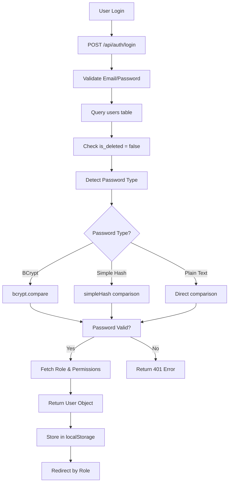

# Authentication System Analysis & Desktop Implementation Guide
## Palaka Furniture ERP - Login & User Management

**Date**: October 19, 2025  
**Purpose**: Analyze current web authentication and implement in desktop app  
**Status**: Analysis Complete + Implementation Guide

---

## 🔐 **CURRENT AUTHENTICATION SYSTEM ANALYSIS**

### **Database Schema**

#### 1. **Users Table Structure**
```sql
CREATE TABLE public.users (
  id uuid NOT NULL,                              -- Primary key
  email text,                                    -- User email (unique login)
  role_id uuid NOT NULL,                         -- Foreign key to roles table
  created_at timestamp without time zone DEFAULT now(),
  password text,                                 -- Hashed password
  name text,                                     -- User display name
  is_deleted boolean NOT NULL DEFAULT false,    -- Soft delete flag
  image_url text,                               -- Profile picture
  CONSTRAINT users_pkey PRIMARY KEY (id),
  CONSTRAINT fk_role FOREIGN KEY (role_id) REFERENCES public.roles(id)
);
```

#### 2. **Roles Table Structure**
```sql
CREATE TABLE public.roles (
  id uuid NOT NULL DEFAULT gen_random_uuid(),
  name text NOT NULL UNIQUE,                    -- Role name (e.g., "System Administrator")
  CONSTRAINT roles_pkey PRIMARY KEY (id)
);
```

#### 3. **Role-Based Permissions**
- Uses `role_permissions` table linking roles to permissions
- Permissions stored in `permissions` table
- Each user gets all permissions associated with their role

---

## 🛡️ **PASSWORD HASHING SYSTEM**

### **Current Implementation (Hybrid Approach)**

Your system supports **3 password formats**:

#### 1. **BCrypt Hashing** (Recommended/Current)
```typescript
// Signup: Hash password with bcrypt
const hashedPassword = await bcrypt.hash(password, 10);

// Login: Verify with bcrypt
const passwordMatches = await bcrypt.compare(password, user.password);

// Pattern Recognition
function isHashedPassword(password: string): boolean {
  return /^\$2[ayb]\$\d{2}\$.{53}$/.test(password);
}
```

**BCrypt Format**: `$2a$10$N9qo8uLOickgx2ZMRZoMyeIjZAgcfl7p92ldGxad68LJZdL17lhWy`
- `$2a$` = BCrypt algorithm version
- `10` = Salt rounds (2^10 = 1024 iterations)
- Remaining 53 chars = Salt + Hash

#### 2. **Simple Hash** (Legacy/Mobile)
```typescript
// Simple hash function for mobile compatibility
function simpleHash(str: string): string {
  let hash = 0;
  if (str.length === 0) return hash.toString();
  for (let i = 0; i < str.length; i++) {
    const char = str.charCodeAt(i);
    hash = ((hash << 5) - hash) + char;
    hash = hash & hash; // Convert to 32bit integer
  }
  return `SIMPLE_${Math.abs(hash).toString(36)}_${str.length}`;
}

// Example: "password123" → "SIMPLE_1a2b3c4d_11"
```

#### 3. **Plain Text** (Legacy/Testing)
```typescript
// Direct string comparison for old accounts
passwordMatches = password === user.password;
```

---

## 🔄 **AUTHENTICATION FLOW**

### **1. Login Process**



### **2. User Object Structure**
```typescript
// Response from /api/auth/login
interface AuthenticatedUser {
  id: string;              // UUID
  email: string;           // User email
  role: string;            // Role name (e.g., "System Administrator")
  permissions: string[];   // Array of permission names
  // Note: password is excluded for security
}

// Example Response
{
  "id": "123e4567-e89b-12d3-a456-426614174000",
  "email": "admin@palaka.com",
  "role": "System Administrator",
  "permissions": [
    "view_dashboard",
    "manage_users",
    "view_reports",
    "edit_inventory",
    "process_sales"
  ]
}
```

### **3. Finance/Accounting Access Control**
**Desktop App Restriction**: Only finance and accounting-related users can access the accounting desktop software.

```typescript
// Allowed roles for desktop accounting app
const allowedAccountingRoles = [
  "System Administrator",    // Full system access
  "Executive",              // Executive oversight
  "Finance Manager",        // Primary accounting user
  "Accountant",            // Day-to-day accounting operations
  "Finance Staff",         // Junior accounting staff
  "Auditor"                // Audit and compliance
];

// Role-based feature access within desktop app
const roleFeatureMap: Record<string, string[]> = {
  "System Administrator": ["*"], // All features
  "Executive": ["view_reports", "view_dashboards", "export_data"],
  "Finance Manager": ["*"], // All accounting features
  "Accountant": [
    "create_transactions", "edit_transactions", "bank_reconciliation",
    "generate_reports", "manage_invoices", "manage_payments"
  ],
  "Finance Staff": [
    "create_transactions", "edit_transactions", "data_entry", "basic_reports"
  ],
  "Auditor": ["view_all", "audit_trail", "export_data", "generate_reports"]
};
```

---

## 💻 **DESKTOP APP AUTHENTICATION IMPLEMENTATION**

### **Option 1: .NET WPF Implementation**

#### **1. Database Connection Setup**
```csharp
// Models/User.cs
public class User
{
    public Guid Id { get; set; }
    public string Email { get; set; }
    public string Name { get; set; }
    public Guid RoleId { get; set; }
    public string Password { get; set; }
    public bool IsDeleted { get; set; }
    public string ImageUrl { get; set; }
    public DateTime CreatedAt { get; set; }
    
    // Navigation properties
    public Role Role { get; set; }
}

public class Role
{
    public Guid Id { get; set; }
    public string Name { get; set; }
    public List<Permission> Permissions { get; set; }
}

public class Permission
{
    public Guid Id { get; set; }
    public string Name { get; set; }
}
```

#### **2. Entity Framework Context**
```csharp
// Data/PalakaDbContext.cs
using Microsoft.EntityFrameworkCore;
using Npgsql;

public class PalakaDbContext : DbContext
{
    public DbSet<User> Users { get; set; }
    public DbSet<Role> Roles { get; set; }
    public DbSet<Permission> Permissions { get; set; }
    
    protected override void OnConfiguring(DbContextOptionsBuilder optionsBuilder)
    {
        var connectionString = "Host=jsbvognrzsjrrrushzvt.supabase.co;" +
                              "Database=postgres;" +
                              "Username=postgres;" +
                              "Password=your-db-password;" +
                              "Port=5432;" +
                              "SSL Mode=Require;" +
                              "Trust Server Certificate=true";
        
        optionsBuilder.UseNpgsql(connectionString);
    }
    
    protected override void OnModelCreating(ModelBuilder modelBuilder)
    {
        // Configure User table
        modelBuilder.Entity<User>(entity =>
        {
            entity.ToTable("users");
            entity.HasKey(e => e.Id);
            entity.Property(e => e.Id).HasColumnName("id");
            entity.Property(e => e.Email).HasColumnName("email");
            entity.Property(e => e.Name).HasColumnName("name");
            entity.Property(e => e.Password).HasColumnName("password");
            entity.Property(e => e.RoleId).HasColumnName("role_id");
            entity.Property(e => e.IsDeleted).HasColumnName("is_deleted");
            entity.Property(e => e.ImageUrl).HasColumnName("image_url");
            entity.Property(e => e.CreatedAt).HasColumnName("created_at");
            
            // Relationship with Role
            entity.HasOne(u => u.Role)
                  .WithMany()
                  .HasForeignKey(u => u.RoleId);
        });
        
        // Configure Role table
        modelBuilder.Entity<Role>(entity =>
        {
            entity.ToTable("roles");
            entity.HasKey(e => e.Id);
            entity.Property(e => e.Id).HasColumnName("id");
            entity.Property(e => e.Name).HasColumnName("name");
        });
    }
}
```

#### **3. Authentication Service**
```csharp
// Services/AuthenticationService.cs
using BCrypt.Net;
using Microsoft.EntityFrameworkCore;

public class AuthenticationService
{
    private readonly PalakaDbContext _context;
    
    public AuthenticationService(PalakaDbContext context)
    {
        _context = context;
    }
    
    public async Task<AuthResult> LoginAsync(string email, string password)
    {
        try
        {
            // Step 1: Find user
            var user = await _context.Users
                .Include(u => u.Role)
                .FirstOrDefaultAsync(u => u.Email == email && !u.IsDeleted);
            
            if (user == null)
            {
                return AuthResult.Failed("User not found or account disabled");
            }
            
            // Step 2: Check if user has finance/accounting access
            var allowedRoles = new[] {
                "System Administrator",
                "Executive", 
                "Finance Manager",
                "Accountant",
                "Finance Staff",
                "Auditor"
            };
            
            if (!allowedRoles.Contains(user.Role.Name))
            {
                return AuthResult.Failed("Access denied. This application is restricted to finance and accounting users only.");
            }
            
            // Step 3: Verify password (same logic as web app)
            bool passwordValid = false;
            
            if (IsHashedPassword(user.Password))
            {
                // BCrypt verification
                passwordValid = BCrypt.Net.BCrypt.Verify(password, user.Password);
            }
            else if (IsSimpleHash(user.Password))
            {
                // Simple hash verification
                passwordValid = SimpleHash(password) == user.Password;
            }
            else
            {
                // Plain text verification
                passwordValid = password == user.Password;
            }
            
            if (!passwordValid)
            {
                return AuthResult.Failed("Invalid password");
            }
            
            // Step 4: Get permissions
            var permissions = await GetUserPermissionsAsync(user.RoleId);
            
            // Step 5: Get role-specific features for desktop app
            var roleFeatures = GetRoleFeatures(user.Role.Name);
            
            // Step 6: Create session
            var userSession = new UserSession
            {
                Id = user.Id,
                Email = user.Email,
                Name = user.Name,
                Role = user.Role.Name,
                Permissions = permissions,
                Features = roleFeatures,
                LoginTime = DateTime.UtcNow
            };
            
            return AuthResult.Success(userSession);
        }
        catch (Exception ex)
        {
            return AuthResult.Failed($"Login failed: {ex.Message}");
        }
    }
    
    private async Task<List<string>> GetUserPermissionsAsync(Guid roleId)
    {
        var permissions = await _context.Database
            .SqlQueryRaw<string>(@"
                SELECT p.name 
                FROM role_permissions rp 
                JOIN permissions p ON rp.permission_id = p.id 
                WHERE rp.role_id = {0}", roleId)
            .ToListAsync();
        
        return permissions;
    }
    
    private List<string> GetRoleFeatures(string roleName)
    {
        var roleFeatures = new Dictionary<string, List<string>>
        {
            ["System Administrator"] = new List<string> { "*" }, // All features
            ["Executive"] = new List<string> { 
                "view_reports", "view_dashboards", "export_data", "financial_overview"
            },
            ["Finance Manager"] = new List<string> { "*" }, // All accounting features
            ["Accountant"] = new List<string> {
                "create_transactions", "edit_transactions", "bank_reconciliation",
                "generate_reports", "manage_invoices", "manage_payments", "journal_entries",
                "trial_balance", "financial_statements", "tax_reports"
            },
            ["Finance Staff"] = new List<string> {
                "create_transactions", "edit_transactions", "data_entry", "basic_reports",
                "view_invoices", "view_payments"
            },
            ["Auditor"] = new List<string> {
                "view_all", "audit_trail", "export_data", "generate_reports", 
                "compliance_reports", "transaction_history"
            }
        };
        
        return roleFeatures.GetValueOrDefault(roleName, new List<string>());
    }
    
    private bool IsHashedPassword(string password)
    {
        return !string.IsNullOrEmpty(password) && 
               System.Text.RegularExpressions.Regex.IsMatch(password, @"^\$2[ayb]\$\d{2}\$.{53}$");
    }
    
    private bool IsSimpleHash(string password)
    {
        return !string.IsNullOrEmpty(password) && password.StartsWith("SIMPLE_");
    }
    
    private string SimpleHash(string str)
    {
        int hash = 0;
        if (str.Length == 0) return hash.ToString();
        
        for (int i = 0; i < str.Length; i++)
        {
            char c = str[i];
            hash = ((hash << 5) - hash) + c;
            hash = hash & hash; // Convert to 32bit integer
        }
        
        return $"SIMPLE_{Math.Abs(hash).ToString("x")}_{str.Length}";
    }
}

// Supporting classes
public class AuthResult
{
    public bool IsSuccess { get; set; }
    public string ErrorMessage { get; set; }
    public UserSession User { get; set; }
    
    public static AuthResult Success(UserSession user) => new AuthResult 
    { 
        IsSuccess = true, 
        User = user 
    };
    
    public static AuthResult Failed(string error) => new AuthResult 
    { 
        IsSuccess = false, 
        ErrorMessage = error 
    };
}

public class UserSession
{
    public Guid Id { get; set; }
    public string Email { get; set; }
    public string Name { get; set; }
    public string Role { get; set; }
    public List<string> Permissions { get; set; }
    public List<string> Features { get; set; }  // Role-specific desktop features
    public DateTime LoginTime { get; set; }
}
```

#### **4. Login Window (WPF)**
```xml
<!-- Views/LoginWindow.xaml -->
<Window x:Class="PalakaDesktop.Views.LoginWindow"
        xmlns="http://schemas.microsoft.com/winfx/2006/xaml/presentation"
        xmlns:x="http://schemas.microsoft.com/winfx/2006/xaml"
        Title="Palaka Furniture ERP - Login" 
        Height="500" Width="400"
        WindowStartupLocation="CenterScreen"
        ResizeMode="NoResize">
    
    <Border Background="#F5F5F5" Padding="40">
        <StackPanel>
            <!-- Logo -->
            <Image Source="/Assets/logo.png" Height="80" Margin="0,0,0,30"/>
            
            <!-- Title -->
            <TextBlock Text="Palaka Furniture ERP" 
                       FontSize="24" FontWeight="Bold" 
                       HorizontalAlignment="Center" 
                       Margin="0,0,0,10"/>
            
            <TextBlock Text="Desktop Accounting System" 
                       FontSize="14" 
                       HorizontalAlignment="Center" 
                       Foreground="Gray"
                       Margin="0,0,0,30"/>
            
            <!-- Email Input -->
            <TextBlock Text="Email Address" FontWeight="SemiBold" Margin="0,0,0,5"/>
            <TextBox x:Name="EmailTextBox" 
                     Height="35" 
                     Padding="10,8" 
                     FontSize="14"
                     Margin="0,0,0,15"/>
            
            <!-- Password Input -->
            <TextBlock Text="Password" FontWeight="SemiBold" Margin="0,0,0,5"/>
            <PasswordBox x:Name="PasswordBox" 
                         Height="35" 
                         Padding="10,8" 
                         FontSize="14"
                         Margin="0,0,0,20"/>
            
            <!-- Error Message -->
            <TextBlock x:Name="ErrorTextBlock" 
                       Foreground="Red" 
                       FontSize="12"
                       Visibility="Collapsed"
                       Margin="0,0,0,15"/>
            
            <!-- Login Button -->
            <Button x:Name="LoginButton" 
                    Content="Log In" 
                    Height="40" 
                    FontSize="16" 
                    FontWeight="SemiBold"
                    Background="#2563EB"
                    Foreground="White"
                    BorderThickness="0"
                    Click="LoginButton_Click"
                    Margin="0,0,0,20"/>
            
            <!-- Loading Indicator -->
            <StackPanel x:Name="LoadingPanel" 
                        Orientation="Horizontal" 
                        HorizontalAlignment="Center"
                        Visibility="Collapsed">
                <ProgressBar IsIndeterminate="True" 
                             Width="20" Height="20" 
                             Margin="0,0,10,0"/>
                <TextBlock Text="Authenticating..." FontStyle="Italic"/>
            </StackPanel>
            
            <!-- Version Info -->
            <TextBlock Text="Version 1.0.0" 
                       FontSize="10" 
                       HorizontalAlignment="Center" 
                       Foreground="Gray"
                       Margin="0,30,0,0"/>
        </StackPanel>
    </Border>
</Window>
```

```csharp
// Views/LoginWindow.xaml.cs
using System.Windows;

namespace PalakaDesktop.Views
{
    public partial class LoginWindow : Window
    {
        private readonly AuthenticationService _authService;
        
        public LoginWindow()
        {
            InitializeComponent();
            _authService = new AuthenticationService(new PalakaDbContext());
        }
        
        private async void LoginButton_Click(object sender, RoutedEventArgs e)
        {
            // Validate inputs
            if (string.IsNullOrWhiteSpace(EmailTextBox.Text))
            {
                ShowError("Please enter your email address");
                return;
            }
            
            if (string.IsNullOrWhiteSpace(PasswordBox.Password))
            {
                ShowError("Please enter your password");
                return;
            }
            
            // Show loading state
            SetLoadingState(true);
            
            try
            {
                // Attempt login
                var result = await _authService.LoginAsync(
                    EmailTextBox.Text.Trim(), 
                    PasswordBox.Password
                );
                
                if (result.IsSuccess)
                {
                    // Store user session
                    App.Current.Properties["UserSession"] = result.User;
                    
                    // Open main window
                    var mainWindow = new MainWindow();
                    mainWindow.Show();
                    
                    // Close login window
                    this.Close();
                }
                else
                {
                    ShowError(result.ErrorMessage);
                }
            }
            catch (Exception ex)
            {
                ShowError($"Connection failed: {ex.Message}");
            }
            finally
            {
                SetLoadingState(false);
            }
        }
        
        private void ShowError(string message)
        {
            ErrorTextBlock.Text = message;
            ErrorTextBlock.Visibility = Visibility.Visible;
        }
        
        private void SetLoadingState(bool isLoading)
        {
            LoginButton.IsEnabled = !isLoading;
            LoadingPanel.Visibility = isLoading ? Visibility.Visible : Visibility.Collapsed;
            ErrorTextBlock.Visibility = Visibility.Collapsed;
        }
    }
}
```

#### **5. Session Management**
```csharp
// Services/SessionManager.cs
public static class SessionManager
{
    private static UserSession _currentUser;
    
    public static UserSession CurrentUser
    {
        get => _currentUser;
        private set => _currentUser = value;
    }
    
    public static void SetUser(UserSession user)
    {
        CurrentUser = user;
        SaveSession(user);
    }
    
    public static void Logout()
    {
        CurrentUser = null;
        ClearSession();
    }
    
    public static bool IsLoggedIn => CurrentUser != null;
    
    public static bool HasPermission(string permission)
    {
        return CurrentUser?.Permissions?.Contains(permission) ?? false;
    }
    
    public static bool HasRole(string role)
    {
        return CurrentUser?.Role == role;
    }
    
    // Persist session to encrypted local storage
    private static void SaveSession(UserSession user)
    {
        try
        {
            var json = System.Text.Json.JsonSerializer.Serialize(user);
            var encrypted = ProtectedData.Protect(
                System.Text.Encoding.UTF8.GetBytes(json),
                null,
                DataProtectionScope.CurrentUser
            );
            
            var appDataPath = Environment.GetFolderPath(Environment.SpecialFolder.ApplicationData);
            var sessionPath = Path.Combine(appDataPath, "PalakaERP", "session.dat");
            
            Directory.CreateDirectory(Path.GetDirectoryName(sessionPath));
            File.WriteAllBytes(sessionPath, encrypted);
        }
        catch (Exception ex)
        {
            // Log error but don't block login
            Console.WriteLine($"Failed to save session: {ex.Message}");
        }
    }
    
    // Restore session from local storage
    public static bool TryRestoreSession()
    {
        try
        {
            var appDataPath = Environment.GetFolderPath(Environment.SpecialFolder.ApplicationData);
            var sessionPath = Path.Combine(appDataPath, "PalakaERP", "session.dat");
            
            if (!File.Exists(sessionPath))
                return false;
            
            var encrypted = File.ReadAllBytes(sessionPath);
            var decrypted = ProtectedData.Unprotect(
                encrypted,
                null,
                DataProtectionScope.CurrentUser
            );
            
            var json = System.Text.Encoding.UTF8.GetString(decrypted);
            var user = System.Text.Json.JsonSerializer.Deserialize<UserSession>(json);
            
            // Check if session is still valid (e.g., not older than 24 hours)
            if (DateTime.UtcNow - user.LoginTime < TimeSpan.FromHours(24))
            {
                CurrentUser = user;
                return true;
            }
            
            // Session expired, clean up
            ClearSession();
            return false;
        }
        catch (Exception ex)
        {
            Console.WriteLine($"Failed to restore session: {ex.Message}");
            ClearSession();
            return false;
        }
    }
    
    private static void ClearSession()
    {
        try
        {
            var appDataPath = Environment.GetFolderPath(Environment.SpecialFolder.ApplicationData);
            var sessionPath = Path.Combine(appDataPath, "PalakaERP", "session.dat");
            
            if (File.Exists(sessionPath))
                File.Delete(sessionPath);
        }
        catch (Exception ex)
        {
            Console.WriteLine($"Failed to clear session: {ex.Message}");
        }
    }
}
```

#### **6. Application Startup**
```csharp
// App.xaml.cs
public partial class App : Application
{
    protected override void OnStartup(StartupEventArgs e)
    {
        base.OnStartup(e);
        
        // Try to restore previous session
        if (SessionManager.TryRestoreSession())
        {
            // User is already logged in, go directly to main window
            var mainWindow = new MainWindow();
            mainWindow.Show();
        }
        else
        {
            // Show login window
            var loginWindow = new LoginWindow();
            loginWindow.Show();
        }
    }
}
```

---

## 🎨 **COMPLETE UI WORKFLOW FOR DESKTOP ACCOUNTING APP**

### **1. Application Architecture Overview**

```
┌─────────────────────────────────────────────────────────────────┐
│                    PALAKA ACCOUNTING DESKTOP                    │
├─────────────────────────────────────────────────────────────────┤
│  LOGIN WINDOW                                                   │
│  ├── Email/Password Authentication                              │
│  ├── Role Validation (Finance/Accounting Only)                 │
│  └── Session Creation                                           │
├─────────────────────────────────────────────────────────────────┤
│  MAIN WINDOW                                                    │
│  ├── Navigation Sidebar (Role-based)                           │
│  ├── Content Area (Tabbed Interface)                           │
│  ├── Status Bar (User Info, Sync Status)                       │
│  └── Quick Actions Toolbar                                     │
├─────────────────────────────────────────────────────────────────┤
│  CONTENT MODULES                                                │
│  ├── 📊 Dashboard (Executive Overview)                          │
│  ├── 📋 All Transactions (Master Grid)                         │
│  ├── 💰 Sales & Invoices                                       │
│  ├── 🛒 Purchases & Bills                                      │
│  ├── 💳 Payments & Receipts                                    │
│  ├── 🏦 Bank Reconciliation                                    │
│  ├── 📖 Journal Entries                                        │
│  ├── 📊 Financial Reports                                      │
│  ├── ⚙️ Chart of Accounts                                      │
│  └── 🔍 Audit Trail                                           │
└─────────────────────────────────────────────────────────────────┘
```

### **2. Main Window Layout (WPF)**

```xml
<!-- Views/MainWindow.xaml -->
<Window x:Class="PalakaDesktop.Views.MainWindow"
        xmlns="http://schemas.microsoft.com/winfx/2006/xaml/presentation"
        xmlns:x="http://schemas.microsoft.com/winfx/2006/xaml"
        Title="Palaka Furniture ERP - Accounting Desktop" 
        Height="900" Width="1400"
        WindowState="Maximized"
        WindowStartupLocation="CenterScreen">
    
    <Grid>
        <Grid.RowDefinitions>
            <RowDefinition Height="40"/>    <!-- Title Bar -->
            <RowDefinition Height="50"/>    <!-- Toolbar -->
            <RowDefinition Height="*"/>     <!-- Main Content -->
            <RowDefinition Height="25"/>    <!-- Status Bar -->
        </Grid.RowDefinitions>
        
        <!-- Custom Title Bar -->
        <Border Grid.Row="0" Background="#1e293b" BorderBrush="#334155" BorderThickness="0,0,0,1">
            <Grid>
                <Grid.ColumnDefinitions>
                    <ColumnDefinition Width="*"/>
                    <ColumnDefinition Width="Auto"/>
                </Grid.ColumnDefinitions>
                
                <!-- App Title & User Info -->
                <StackPanel Orientation="Horizontal" VerticalAlignment="Center" Margin="15,0">
                    <Image Source="/Assets/logo-white.png" Height="24" Margin="0,0,10,0"/>
                    <TextBlock Text="Palaka Furniture ERP" Foreground="White" FontWeight="SemiBold" VerticalAlignment="Center"/>
                    <TextBlock Text=" - Accounting Desktop" Foreground="#94a3b8" VerticalAlignment="Center"/>
                    <TextBlock x:Name="UserInfoText" Text="{Binding CurrentUser.Name}" 
                               Foreground="#cbd5e1" Margin="30,0,0,0" VerticalAlignment="Center"/>
                    <TextBlock x:Name="UserRoleText" Text="{Binding CurrentUser.Role}" 
                               Foreground="#64748b" Margin="10,0,0,0" VerticalAlignment="Center"/>
                </StackPanel>
                
                <!-- Window Controls -->
                <StackPanel Grid.Column="1" Orientation="Horizontal">
                    <Button Content="🗕" Width="30" Height="30" Click="MinimizeButton_Click" 
                            Background="Transparent" Foreground="White" BorderThickness="0"/>
                    <Button Content="🗖" Width="30" Height="30" Click="MaximizeButton_Click"
                            Background="Transparent" Foreground="White" BorderThickness="0"/>
                    <Button Content="✕" Width="30" Height="30" Click="CloseButton_Click"
                            Background="Transparent" Foreground="White" BorderThickness="0"/>
                </StackPanel>
            </Grid>
        </Border>
        
        <!-- Toolbar -->
        <Border Grid.Row="1" Background="#f8fafc" BorderBrush="#e2e8f0" BorderThickness="0,0,0,1">
            <StackPanel Orientation="Horizontal" Margin="15,0" VerticalAlignment="Center">
                <!-- Quick Actions -->
                <Button x:Name="NewTransactionBtn" Content="+ New Transaction" 
                        Background="#3b82f6" Foreground="White" Padding="12,8" Margin="0,0,10,0"
                        Click="NewTransaction_Click"/>
                <Button x:Name="SaveBtn" Content="💾 Save" Padding="10,8" Margin="0,0,5,0" Click="Save_Click"/>
                <Button x:Name="UndoBtn" Content="↶ Undo" Padding="10,8" Margin="0,0,5,0" Click="Undo_Click"/>
                <Button x:Name="RedoBtn" Content="↷ Redo" Padding="10,8" Margin="0,0,15,0" Click="Redo_Click"/>
                
                <Separator/>
                
                <!-- Filters -->
                <TextBlock Text="Date Range:" VerticalAlignment="Center" Margin="15,0,5,0"/>
                <ComboBox x:Name="DateFilterCombo" Width="120" Margin="0,0,10,0" 
                          SelectionChanged="DateFilter_Changed"/>
                
                <TextBlock Text="Account:" VerticalAlignment="Center" Margin="10,0,5,0"/>
                <ComboBox x:Name="AccountFilterCombo" Width="150" Margin="0,0,10,0"
                          SelectionChanged="AccountFilter_Changed"/>
                
                <!-- Search -->
                <TextBox x:Name="SearchBox" Width="200" Margin="15,0,5,0" 
                         Watermark="Search transactions..." TextChanged="Search_TextChanged"/>
                <Button Content="🔍" Padding="8" Click="Search_Click"/>
                
                <!-- Sync Status -->
                <StackPanel Orientation="Horizontal" Margin="20,0,0,0">
                    <Ellipse x:Name="SyncIndicator" Width="8" Height="8" Fill="Green" VerticalAlignment="Center"/>
                    <TextBlock x:Name="SyncStatusText" Text="Synced" Margin="5,0" VerticalAlignment="Center"/>
                </StackPanel>
            </StackPanel>
        </Border>
        
        <!-- Main Content Area -->
        <Grid Grid.Row="2">
            <Grid.ColumnDefinitions>
                <ColumnDefinition Width="250"/>  <!-- Navigation Sidebar -->
                <ColumnDefinition Width="5"/>    <!-- Splitter -->
                <ColumnDefinition Width="*"/>    <!-- Content Area -->
            </Grid.ColumnDefinitions>
            
            <!-- Navigation Sidebar -->
            <Border Grid.Column="0" Background="#f1f5f9" BorderBrush="#e2e8f0" BorderThickness="0,0,1,0">
                <StackPanel Margin="0,10,0,0">
                    <!-- Dashboard -->
                    <Button x:Name="DashboardBtn" Content="📊 Dashboard" 
                            HorizontalAlignment="Stretch" HorizontalContentAlignment="Left"
                            Padding="20,12" Background="Transparent" BorderThickness="0"
                            Click="Navigate_Dashboard"/>
                    
                    <!-- Separator -->
                    <Border Height="1" Background="#e2e8f0" Margin="15,10"/>
                    
                    <!-- Transaction Management -->
                    <TextBlock Text="TRANSACTIONS" Margin="20,10,0,5" FontWeight="Bold" 
                               Foreground="#64748b" FontSize="11"/>
                    
                    <Button x:Name="AllTransactionsBtn" Content="📋 All Transactions"
                            HorizontalAlignment="Stretch" HorizontalContentAlignment="Left"
                            Padding="20,10" Background="Transparent" BorderThickness="0"
                            Click="Navigate_AllTransactions"/>
                    
                    <Button x:Name="SalesInvoicesBtn" Content="💰 Sales & Invoices"
                            HorizontalAlignment="Stretch" HorizontalContentAlignment="Left"
                            Padding="20,10" Background="Transparent" BorderThickness="0"
                            Click="Navigate_SalesInvoices"
                            Visibility="{Binding HasFeature, ConverterParameter=manage_invoices}"/>
                    
                    <Button x:Name="PurchasesBillsBtn" Content="🛒 Purchases & Bills"
                            HorizontalAlignment="Stretch" HorizontalContentAlignment="Left"
                            Padding="20,10" Background="Transparent" BorderThickness="0"
                            Click="Navigate_PurchasesBills"
                            Visibility="{Binding HasFeature, ConverterParameter=manage_purchases}"/>
                    
                    <Button x:Name="PaymentsReceiptsBtn" Content="💳 Payments & Receipts"
                            HorizontalAlignment="Stretch" HorizontalContentAlignment="Left"
                            Padding="20,10" Background="Transparent" BorderThickness="0"
                            Click="Navigate_PaymentsReceipts"
                            Visibility="{Binding HasFeature, ConverterParameter=manage_payments}"/>
                    
                    <!-- Banking -->
                    <TextBlock Text="BANKING" Margin="20,15,0,5" FontWeight="Bold" 
                               Foreground="#64748b" FontSize="11"/>
                    
                    <Button x:Name="BankReconciliationBtn" Content="🏦 Bank Reconciliation"
                            HorizontalAlignment="Stretch" HorizontalContentAlignment="Left"
                            Padding="20,10" Background="Transparent" BorderThickness="0"
                            Click="Navigate_BankReconciliation"
                            Visibility="{Binding HasFeature, ConverterParameter=bank_reconciliation}"/>
                    
                    <Button x:Name="JournalEntriesBtn" Content="📖 Journal Entries"
                            HorizontalAlignment="Stretch" HorizontalContentAlignment="Left"
                            Padding="20,10" Background="Transparent" BorderThickness="0"
                            Click="Navigate_JournalEntries"
                            Visibility="{Binding HasFeature, ConverterParameter=journal_entries}"/>
                    
                    <!-- Reports -->
                    <TextBlock Text="REPORTS" Margin="20,15,0,5" FontWeight="Bold" 
                               Foreground="#64748b" FontSize="11"/>
                    
                    <Button x:Name="FinancialReportsBtn" Content="📊 Financial Reports"
                            HorizontalAlignment="Stretch" HorizontalContentAlignment="Left"
                            Padding="20,10" Background="Transparent" BorderThickness="0"
                            Click="Navigate_FinancialReports"
                            Visibility="{Binding HasFeature, ConverterParameter=generate_reports}"/>
                    
                    <Button x:Name="TrialBalanceBtn" Content="⚖️ Trial Balance"
                            HorizontalAlignment="Stretch" HorizontalContentAlignment="Left"
                            Padding="20,10" Background="Transparent" BorderThickness="0"
                            Click="Navigate_TrialBalance"
                            Visibility="{Binding HasFeature, ConverterParameter=trial_balance}"/>
                    
                    <!-- Administration -->
                    <TextBlock Text="ADMINISTRATION" Margin="20,15,0,5" FontWeight="Bold" 
                               Foreground="#64748b" FontSize="11"
                               Visibility="{Binding IsAdmin}"/>
                    
                    <Button x:Name="ChartOfAccountsBtn" Content="⚙️ Chart of Accounts"
                            HorizontalAlignment="Stretch" HorizontalContentAlignment="Left"
                            Padding="20,10" Background="Transparent" BorderThickness="0"
                            Click="Navigate_ChartOfAccounts"
                            Visibility="{Binding IsAdmin}"/>
                    
                    <Button x:Name="AuditTrailBtn" Content="🔍 Audit Trail"
                            HorizontalAlignment="Stretch" HorizontalContentAlignment="Left"
                            Padding="20,10" Background="Transparent" BorderThickness="0"
                            Click="Navigate_AuditTrail"/>
                    
                    <!-- Bottom Actions -->
                    <Border Height="1" Background="#e2e8f0" Margin="15,20,15,10"/>
                    
                    <Button x:Name="SettingsBtn" Content="⚙️ Settings"
                            HorizontalAlignment="Stretch" HorizontalContentAlignment="Left"
                            Padding="20,10" Background="Transparent" BorderThickness="0"
                            Click="Navigate_Settings"/>
                    
                    <Button x:Name="LogoutBtn" Content="🚪 Logout"
                            HorizontalAlignment="Stretch" HorizontalContentAlignment="Left"
                            Padding="20,10" Background="Transparent" BorderThickness="0"
                            Foreground="#dc2626" Click="Logout_Click"/>
                </StackPanel>
            </Border>
            
            <!-- Splitter -->
            <GridSplitter Grid.Column="1" Width="5" Background="#e2e8f0" 
                          HorizontalAlignment="Stretch" VerticalAlignment="Stretch"/>
            
            <!-- Content Area -->
            <Border Grid.Column="2" Background="White">
                <TabControl x:Name="MainTabControl" BorderThickness="0">
                    <!-- Tabs will be added dynamically based on navigation -->
                </TabControl>
            </Border>
        </Grid>
        
        <!-- Status Bar -->
        <Border Grid.Row="3" Background="#f8fafc" BorderBrush="#e2e8f0" BorderThickness="0,1,0,0">
            <Grid>
                <Grid.ColumnDefinitions>
                    <ColumnDefinition Width="*"/>
                    <ColumnDefinition Width="Auto"/>
                </Grid.ColumnDefinitions>
                
                <StackPanel Orientation="Horizontal" Margin="15,0">
                    <TextBlock x:Name="StatusText" Text="Ready" VerticalAlignment="Center"/>
                    <TextBlock Text=" | " Margin="10,0" VerticalAlignment="Center"/>
                    <TextBlock x:Name="RecordCountText" Text="1,234 records" VerticalAlignment="Center"/>
                    <TextBlock Text=" | " Margin="10,0" VerticalAlignment="Center"/>
                    <TextBlock x:Name="FilterStatusText" Text="No filters" VerticalAlignment="Center"/>
                </StackPanel>
                
                <StackPanel Grid.Column="1" Orientation="Horizontal" Margin="0,0,15,0">
                    <TextBlock x:Name="LastSyncText" Text="Last sync: 2 min ago" VerticalAlignment="Center"/>
                    <TextBlock Text=" | " Margin="10,0" VerticalAlignment="Center"/>
                    <TextBlock Text="Version 1.0.0" VerticalAlignment="Center" Foreground="#64748b"/>
                </StackPanel>
            </Grid>
        </Border>
    </Grid>
</Window>
```

### **3. Content Views by Role**

#### **A. Executive Dashboard**
```xml
<!-- Views/ExecutiveDashboard.xaml -->
<UserControl x:Class="PalakaDesktop.Views.ExecutiveDashboard">
    <Grid Margin="20">
        <Grid.RowDefinitions>
            <RowDefinition Height="Auto"/>
            <RowDefinition Height="Auto"/>
            <RowDefinition Height="*"/>
        </Grid.RowDefinitions>
        
        <!-- Header -->
        <StackPanel Grid.Row="0" Margin="0,0,0,20">
            <TextBlock Text="Financial Overview" FontSize="24" FontWeight="Bold"/>
            <TextBlock Text="Executive Dashboard - Real-time Financial Metrics" 
                       Foreground="#64748b" FontSize="14"/>
        </StackPanel>
        
        <!-- KPI Cards -->
        <UniformGrid Grid.Row="1" Columns="4" Margin="0,0,0,20">
            <!-- Total Revenue -->
            <Border Background="#3b82f6" CornerRadius="8" Margin="0,0,10,0" Padding="20">
                <StackPanel>
                    <TextBlock Text="Total Revenue" Foreground="White" FontWeight="SemiBold"/>
                    <TextBlock x:Name="TotalRevenueText" Text="₹2,45,67,890" 
                               Foreground="White" FontSize="28" FontWeight="Bold"/>
                    <TextBlock Text="+12.5% from last month" Foreground="#dbeafe" FontSize="12"/>
                </StackPanel>
            </Border>
            
            <!-- Total Expenses -->
            <Border Background="#ef4444" CornerRadius="8" Margin="0,0,10,0" Padding="20">
                <StackPanel>
                    <TextBlock Text="Total Expenses" Foreground="White" FontWeight="SemiBold"/>
                    <TextBlock x:Name="TotalExpensesText" Text="₹1,78,23,456" 
                               Foreground="White" FontSize="28" FontWeight="Bold"/>
                    <TextBlock Text="+8.3% from last month" Foreground="#fecaca" FontSize="12"/>
                </StackPanel>
            </Border>
            
            <!-- Net Profit -->
            <Border Background="#10b981" CornerRadius="8" Margin="0,0,10,0" Padding="20">
                <StackPanel>
                    <TextBlock Text="Net Profit" Foreground="White" FontWeight="SemiBold"/>
                    <TextBlock x:Name="NetProfitText" Text="₹67,44,434" 
                               Foreground="White" FontSize="28" FontWeight="Bold"/>
                    <TextBlock Text="+18.7% from last month" Foreground="#d1fae5" FontSize="12"/>
                </StackPanel>
            </Border>
            
            <!-- Outstanding Receivables -->
            <Border Background="#f59e0b" CornerRadius="8" Padding="20">
                <StackPanel>
                    <TextBlock Text="Outstanding AR" Foreground="White" FontWeight="SemiBold"/>
                    <TextBlock x:Name="OutstandingARText" Text="₹45,67,123" 
                               Foreground="White" FontSize="28" FontWeight="Bold"/>
                    <TextBlock Text="23 invoices overdue" Foreground="#fef3c7" FontSize="12"/>
                </StackPanel>
            </Border>
        </UniformGrid>
        
        <!-- Charts & Tables -->
        <Grid Grid.Row="2">
            <Grid.ColumnDefinitions>
                <ColumnDefinition Width="2*"/>
                <ColumnDefinition Width="1*"/>
            </Grid.ColumnDefinitions>
            
            <!-- Revenue Trend Chart -->
            <Border Grid.Column="0" Background="White" BorderBrush="#e2e8f0" 
                    BorderThickness="1" CornerRadius="8" Margin="0,0,10,0" Padding="20">
                <StackPanel>
                    <TextBlock Text="Revenue Trend (Last 12 Months)" FontWeight="SemiBold" Margin="0,0,0,15"/>
                    <!-- Chart would go here - using a charting library like LiveCharts -->
                    <Border Height="300" Background="#f8fafc" CornerRadius="4">
                        <TextBlock Text="Revenue Trend Chart" HorizontalAlignment="Center" 
                                   VerticalAlignment="Center" Foreground="#64748b"/>
                    </Border>
                </StackPanel>
            </Border>
            
            <!-- Recent Transactions -->
            <Border Grid.Column="1" Background="White" BorderBrush="#e2e8f0" 
                    BorderThickness="1" CornerRadius="8" Padding="20">
                <StackPanel>
                    <TextBlock Text="Recent Large Transactions" FontWeight="SemiBold" Margin="0,0,0,15"/>
                    <DataGrid x:Name="RecentTransactionsGrid" Height="280" AutoGenerateColumns="False"
                              HeadersVisibility="Column" GridLinesVisibility="None">
                        <DataGrid.Columns>
                            <DataGridTextColumn Header="Date" Binding="{Binding Date}" Width="80"/>
                            <DataGridTextColumn Header="Description" Binding="{Binding Description}" Width="120"/>
                            <DataGridTextColumn Header="Amount" Binding="{Binding Amount}" Width="100"/>
                        </DataGrid.Columns>
                    </DataGrid>
                </StackPanel>
            </Border>
        </Grid>
    </Grid>
</UserControl>
```

#### **B. All Transactions Grid (Master View)**
```xml
<!-- Views/AllTransactionsView.xaml -->
<UserControl x:Class="PalakaDesktop.Views.AllTransactionsView">
    <Grid>
        <Grid.RowDefinitions>
            <RowDefinition Height="Auto"/>
            <RowDefinition Height="Auto"/>
            <RowDefinition Height="*"/>
            <RowDefinition Height="Auto"/>
        </Grid.RowDefinitions>
        
        <!-- Header -->
        <StackPanel Grid.Row="0" Margin="20,20,20,10">
            <TextBlock Text="All Transactions" FontSize="20" FontWeight="Bold"/>
            <TextBlock Text="Complete view of all accounting transactions" 
                       Foreground="#64748b" FontSize="14"/>
        </StackPanel>
        
        <!-- Advanced Filters -->
        <Border Grid.Row="1" Background="#f8fafc" BorderBrush="#e2e8f0" 
                BorderThickness="0,1,0,1" Padding="20,15">
            <StackPanel>
                <!-- First Row of Filters -->
                <Grid Margin="0,0,0,10">
                    <Grid.ColumnDefinitions>
                        <ColumnDefinition Width="Auto"/>
                        <ColumnDefinition Width="150"/>
                        <ColumnDefinition Width="Auto"/>
                        <ColumnDefinition Width="150"/>
                        <ColumnDefinition Width="Auto"/>
                        <ColumnDefinition Width="200"/>
                        <ColumnDefinition Width="*"/>
                    </Grid.ColumnDefinitions>
                    
                    <TextBlock Grid.Column="0" Text="Date Range:" VerticalAlignment="Center" Margin="0,0,10,0"/>
                    <ComboBox Grid.Column="1" x:Name="DateRangeFilter"/>
                    
                    <TextBlock Grid.Column="2" Text="Transaction Type:" VerticalAlignment="Center" Margin="20,0,10,0"/>
                    <ComboBox Grid.Column="3" x:Name="TransactionTypeFilter"/>
                    
                    <TextBlock Grid.Column="4" Text="Account:" VerticalAlignment="Center" Margin="20,0,10,0"/>
                    <ComboBox Grid.Column="5" x:Name="AccountFilter" IsEditable="True"/>
                </Grid>
                
                <!-- Second Row of Filters -->
                <Grid>
                    <Grid.ColumnDefinitions>
                        <ColumnDefinition Width="Auto"/>
                        <ColumnDefinition Width="100"/>
                        <ColumnDefinition Width="Auto"/>
                        <ColumnDefinition Width="100"/>
                        <ColumnDefinition Width="Auto"/>
                        <ColumnDefinition Width="120"/>
                        <ColumnDefinition Width="Auto"/>
                        <ColumnDefinition Width="*"/>
                    </Grid.ColumnDefinitions>
                    
                    <TextBlock Grid.Column="0" Text="Amount Min:" VerticalAlignment="Center" Margin="0,0,10,0"/>
                    <TextBox Grid.Column="1" x:Name="AmountMinFilter"/>
                    
                    <TextBlock Grid.Column="2" Text="Max:" VerticalAlignment="Center" Margin="20,0,10,0"/>
                    <TextBox Grid.Column="3" x:Name="AmountMaxFilter"/>
                    
                    <TextBlock Grid.Column="4" Text="Status:" VerticalAlignment="Center" Margin="20,0,10,0"/>
                    <ComboBox Grid.Column="5" x:Name="StatusFilter"/>
                    
                    <Button Grid.Column="6" Content="Apply Filters" Margin="20,0,10,0" Padding="15,5"
                            Background="#3b82f6" Foreground="White" Click="ApplyFilters_Click"/>
                    <Button Grid.Column="7" Content="Clear" Padding="15,5" Click="ClearFilters_Click"/>
                </Grid>
            </StackPanel>
        </Border>
        
        <!-- Main Data Grid -->
        <DataGrid Grid.Row="2" x:Name="TransactionsDataGrid" 
                  AutoGenerateColumns="False" CanUserAddRows="False"
                  GridLinesVisibility="Horizontal" HeadersVisibility="Column"
                  AlternatingRowBackground="#f8fafc" Margin="20,0">
            
            <DataGrid.Columns>
                <!-- Selection Checkbox -->
                <DataGridCheckBoxColumn Header="☑" Width="30" 
                                        Binding="{Binding IsSelected, UpdateSourceTrigger=PropertyChanged}"/>
                
                <!-- Date -->
                <DataGridTextColumn Header="Date" Binding="{Binding Date, StringFormat=dd/MM/yyyy}" 
                                    Width="90" IsReadOnly="True"/>
                
                <!-- Transaction Type -->
                <DataGridTextColumn Header="Type" Binding="{Binding TransactionType}" 
                                    Width="100" IsReadOnly="True"/>
                
                <!-- Reference Number -->
                <DataGridTextColumn Header="Reference" Binding="{Binding ReferenceNumber}" 
                                    Width="120" IsReadOnly="True"/>
                
                <!-- Account -->
                <DataGridComboBoxColumn Header="Account" Width="180"
                                        SelectedValueBinding="{Binding AccountId}"
                                        DisplayMemberPath="AccountName"
                                        SelectedValuePath="Id"/>
                
                <!-- Description -->
                <DataGridTextColumn Header="Description" Binding="{Binding Description}" 
                                    Width="200"/>
                
                <!-- Debit Amount -->
                <DataGridTextColumn Header="Debit" Binding="{Binding DebitAmount, StringFormat=₹{0:N2}}" 
                                    Width="100" ElementStyle="{StaticResource RightAlignedCell}"/>
                
                <!-- Credit Amount -->
                <DataGridTextColumn Header="Credit" Binding="{Binding CreditAmount, StringFormat=₹{0:N2}}" 
                                    Width="100" ElementStyle="{StaticResource RightAlignedCell}"/>
                
                <!-- Running Balance -->
                <DataGridTextColumn Header="Balance" Binding="{Binding RunningBalance, StringFormat=₹{0:N2}}" 
                                    Width="100" ElementStyle="{StaticResource RightAlignedCell}" IsReadOnly="True"/>
                
                <!-- Status -->
                <DataGridTemplateColumn Header="Status" Width="80">
                    <DataGridTemplateColumn.CellTemplate>
                        <DataTemplate>
                            <Border CornerRadius="3" Padding="5,2">
                                <Border.Style>
                                    <Style TargetType="Border">
                                        <Style.Triggers>
                                            <DataTrigger Binding="{Binding Status}" Value="Posted">
                                                <Setter Property="Background" Value="#dcfce7"/>
                                            </DataTrigger>
                                            <DataTrigger Binding="{Binding Status}" Value="Draft">
                                                <Setter Property="Background" Value="#fef3c7"/>
                                            </DataTrigger>
                                            <DataTrigger Binding="{Binding Status}" Value="Void">
                                                <Setter Property="Background" Value="#fecaca"/>
                                            </DataTrigger>
                                        </Style.Triggers>
                                    </Style>
                                </Border.Style>
                                <TextBlock Text="{Binding Status}" FontSize="11" TextAlignment="Center"/>
                            </Border>
                        </DataTemplate>
                    </DataGridTemplateColumn.CellTemplate>
                </DataGridTemplateColumn>
                
                <!-- Actions -->
                <DataGridTemplateColumn Header="Actions" Width="100">
                    <DataGridTemplateColumn.CellTemplate>
                        <DataTemplate>
                            <StackPanel Orientation="Horizontal">
                                <Button Content="✏️" ToolTip="Edit" Margin="2" Padding="5,2"
                                        Click="EditTransaction_Click"/>
                                <Button Content="👁️" ToolTip="View Details" Margin="2" Padding="5,2"
                                        Click="ViewTransaction_Click"/>
                                <Button Content="🗑️" ToolTip="Delete" Margin="2" Padding="5,2"
                                        Click="DeleteTransaction_Click"
                                        Visibility="{Binding CanDelete, Converter={StaticResource BoolToVisibility}}"/>
                            </StackPanel>
                        </DataTemplate>
                    </DataGridTemplateColumn.CellTemplate>
                </DataGridTemplateColumn>
            </DataGrid.Columns>
            
            <!-- Context Menu -->
            <DataGrid.ContextMenu>
                <ContextMenu>
                    <MenuItem Header="Edit Transaction" Click="EditTransaction_Click"/>
                    <MenuItem Header="View Details" Click="ViewTransaction_Click"/>
                    <MenuItem Header="Duplicate Entry" Click="DuplicateTransaction_Click"/>
                    <Separator/>
                    <MenuItem Header="Mark as Reconciled" Click="MarkReconciled_Click"/>
                    <MenuItem Header="Add to Reconciliation" Click="AddToReconciliation_Click"/>
                    <Separator/>
                    <MenuItem Header="Export Selection" Click="ExportSelection_Click"/>
                    <MenuItem Header="Print Selection" Click="PrintSelection_Click"/>
                    <Separator/>
                    <MenuItem Header="View Audit Trail" Click="ViewAuditTrail_Click"/>
                </ContextMenu>
            </DataGrid.ContextMenu>
        </DataGrid>
        
        <!-- Summary Footer -->
        <Border Grid.Row="3" Background="#f1f5f9" BorderBrush="#e2e8f0" BorderThickness="0,1,0,0" Padding="20,10">
            <Grid>
                <Grid.ColumnDefinitions>
                    <ColumnDefinition Width="*"/>
                    <ColumnDefinition Width="Auto"/>
                </Grid.ColumnDefinitions>
                
                <StackPanel Orientation="Horizontal">
                    <TextBlock Text="Total Records: " FontWeight="SemiBold"/>
                    <TextBlock x:Name="TotalRecordsText" Text="1,234" FontWeight="Bold"/>
                    <TextBlock Text=" | Selected: " Margin="20,0,0,0"/>
                    <TextBlock x:Name="SelectedRecordsText" Text="0"/>
                    <TextBlock Text=" | Filtered: " Margin="20,0,0,0"/>
                    <TextBlock x:Name="FilteredRecordsText" Text="1,234"/>
                </StackPanel>
                
                <StackPanel Grid.Column="1" Orientation="Horizontal">
                    <TextBlock Text="Σ Debit: " FontWeight="SemiBold"/>
                    <TextBlock x:Name="TotalDebitText" Text="₹12,45,67,890" FontWeight="Bold" Foreground="#dc2626"/>
                    <TextBlock Text=" | Σ Credit: " Margin="20,0,0,0" FontWeight="SemiBold"/>
                    <TextBlock x:Name="TotalCreditText" Text="₹12,45,67,890" FontWeight="Bold" Foreground="#16a34a"/>
                    <TextBlock Text=" | Difference: " Margin="20,0,0,0" FontWeight="SemiBold"/>
                    <TextBlock x:Name="DifferenceText" Text="₹0" FontWeight="Bold"/>
                </StackPanel>
            </Grid>
        </Border>
    </Grid>
</UserControl>
```

### **4. User Access Control Implementation**

```csharp
// ViewModels/MainWindowViewModel.cs
public class MainWindowViewModel : INotifyPropertyChanged
{
    private UserSession _currentUser;
    
    public UserSession CurrentUser
    {
        get => _currentUser;
        set
        {
            _currentUser = value;
            OnPropertyChanged();
            UpdateUIBasedOnRole();
        }
    }
    
    public bool IsAdmin => CurrentUser?.Role == "System Administrator";
    public bool IsFinanceManager => CurrentUser?.Role == "Finance Manager";
    public bool IsAccountant => new[] { "Accountant", "Finance Staff" }.Contains(CurrentUser?.Role);
    public bool IsAuditor => CurrentUser?.Role == "Auditor";
    
    public bool HasFeature(string feature)
    {
        if (CurrentUser?.Features?.Contains("*") == true) return true;
        return CurrentUser?.Features?.Contains(feature) == true;
    }
    
    private void UpdateUIBasedOnRole()
    {
        // Update navigation visibility based on role
        switch (CurrentUser?.Role)
        {
            case "Executive":
                // Show only dashboard and reports
                ShowDashboardOnly();
                break;
                
            case "Finance Manager":
            case "System Administrator":
                // Show all features
                ShowAllFeatures();
                break;
                
            case "Accountant":
                // Show transaction management and standard reports
                ShowAccountantFeatures();
                break;
                
            case "Finance Staff":
                // Show limited transaction entry
                ShowFinanceStaffFeatures();
                break;
                
            case "Auditor":
                // Show read-only views and audit trails
                ShowAuditorFeatures();
                break;
        }
    }
    
    private void ShowDashboardOnly()
    {
        // Enable only dashboard, financial reports, and export functions
        // Disable transaction editing
    }
    
    private void ShowAllFeatures()
    {
        // Enable all accounting features
    }
    
    private void ShowAccountantFeatures()
    {
        // Enable transaction management, reconciliation, journal entries
        // Disable chart of accounts management
    }
    
    private void ShowFinanceStaffFeatures()
    {
        // Enable basic transaction entry
        // Disable advanced features like reconciliation, journal entries
    }
    
    private void ShowAuditorFeatures()
    {
        // Enable all views but disable editing
        // Emphasize audit trail and compliance reports
    }
}
```

### **5. Role-Specific Navigation**

```csharp
// Services/NavigationService.cs
public class NavigationService
{
    private readonly MainWindow _mainWindow;
    private readonly UserSession _currentUser;
    
    public NavigationService(MainWindow mainWindow, UserSession currentUser)
    {
        _mainWindow = mainWindow;
        _currentUser = currentUser;
    }
    
    public void NavigateToModule(string moduleName)
    {
        if (!CanAccessModule(moduleName))
        {
            MessageBox.Show($"Access denied. You don't have permission to access {moduleName}.", 
                          "Access Denied", MessageBoxButton.OK, MessageBoxImage.Warning);
            return;
        }
        
        switch (moduleName)
        {
            case "Dashboard":
                ShowDashboard();
                break;
            case "AllTransactions":
                ShowAllTransactions();
                break;
            case "SalesInvoices":
                ShowSalesInvoices();
                break;
            case "BankReconciliation":
                ShowBankReconciliation();
                break;
            // ... other modules
        }
    }
    
    private bool CanAccessModule(string moduleName)
    {
        var requiredFeatures = new Dictionary<string, string>
        {
            ["SalesInvoices"] = "manage_invoices",
            ["PurchasesBills"] = "manage_purchases",
            ["BankReconciliation"] = "bank_reconciliation",
            ["JournalEntries"] = "journal_entries",
            ["ChartOfAccounts"] = "manage_accounts"
        };
        
        if (requiredFeatures.ContainsKey(moduleName))
        {
            return _currentUser.Features.Contains("*") || 
                   _currentUser.Features.Contains(requiredFeatures[moduleName]);
        }
        
        return true; // Default modules accessible to all
    }
}
```

---

## 📱 **USER WORKFLOW BY ROLE**

### **System Administrator**
```
1. Login → Full Access Dashboard
2. Can access ALL modules
3. Can manage Chart of Accounts
4. Can manage user permissions
5. Can access all reports and audit trails
6. Can perform system configuration
```

### **Finance Manager**  
```
1. Login → Financial Dashboard
2. Can access ALL accounting modules
3. Can approve journal entries
4. Can close accounting periods
5. Can generate all financial reports
6. Can perform bank reconciliation
7. Can manage invoices and payments
```

### **Accountant**
```
1. Login → Transaction Dashboard
2. Can create/edit transactions
3. Can manage invoices and payments
4. Can perform bank reconciliation
5. Can create journal entries
6. Can generate standard reports
7. Cannot modify Chart of Accounts
```

### **Finance Staff**
```
1. Login → Data Entry Dashboard  
2. Can create basic transactions
3. Can edit unpaid invoices
4. Can enter payments and receipts
5. Can view basic reports
6. Cannot perform reconciliation
7. Cannot create journal entries
```

### **Executive**
```
1. Login → Executive Dashboard
2. View-only access to all data
3. Can generate financial reports
4. Can export data
5. Cannot edit any transactions
6. Focus on analytics and KPIs
```

### **Auditor**
```
1. Login → Audit Dashboard
2. Read-only access to all transactions
3. Full access to audit trails
4. Can generate compliance reports
5. Can export audit data
6. Cannot modify any data
```

---

## 💡 **NEXT STEPS**

1. **Create Visual Studio WPF Project** with the provided XAML layouts
2. **Implement ViewModels** for each module with role-based permissions
3. **Set up data binding** for dynamic UI updates based on user role
4. **Test authentication flow** with different user roles
5. **Implement the transaction grid** with Excel-like functionality
6. **Add DevExpress grids** for enhanced user experience

Would you like me to create the complete Visual Studio solution with all these UI components and role-based access controls?

---

## 🔐 **SECURITY CONSIDERATIONS**

### **1. Connection Security**
- ✅ Use SSL/TLS for database connections
- ✅ Store connection strings in encrypted configuration
- ✅ Use connection pooling for performance
- ✅ Implement connection timeout handling

### **2. Password Security**
- ✅ Support all existing password formats (BCrypt/Simple/Plain)
- ✅ Always hash new passwords with BCrypt
- ✅ Implement password strength validation
- ✅ Add option to force password reset on first login

### **3. Session Security**
- ✅ Encrypt session data using Windows DPAPI
- ✅ Implement session timeout (24 hours recommended)
- ✅ Clear session on logout
- ✅ Validate session on each app startup

### **4. Role-Based Access Control**
```csharp
// Permission-based UI controls
public class PermissionConverter : IValueConverter
{
    public object Convert(object value, Type targetType, object parameter, CultureInfo culture)
    {
        if (parameter is string permission)
        {
            return SessionManager.HasPermission(permission) ? Visibility.Visible : Visibility.Collapsed;
        }
        return Visibility.Collapsed;
    }
    
    public object ConvertBack(object value, Type targetType, object parameter, CultureInfo culture)
    {
        throw new NotImplementedException();
    }
}

// Usage in XAML
<Button Content="Manage Users" 
        Visibility="{Binding Converter={StaticResource PermissionConverter}, ConverterParameter=manage_users}"/>
```

---

## 📦 **REQUIRED NUGET PACKAGES**

```xml
<!-- .csproj file -->
<PackageReference Include="Microsoft.EntityFrameworkCore" Version="8.0.0" />
<PackageReference Include="Microsoft.EntityFrameworkCore.Tools" Version="8.0.0" />
<PackageReference Include="Npgsql.EntityFrameworkCore.PostgreSQL" Version="8.0.0" />
<PackageReference Include="BCrypt.Net-Next" Version="4.0.3" />
<PackageReference Include="System.Text.Json" Version="8.0.0" />
```

---

## 🚀 **IMPLEMENTATION TIMELINE**

### **Week 1: Database & Models**
- ✅ Set up Entity Framework context
- ✅ Create User/Role/Permission models
- ✅ Test database connectivity

### **Week 2: Authentication Service**
- ✅ Implement password verification logic
- ✅ Create authentication service
- ✅ Add session management

### **Week 3: UI Implementation**
- ✅ Design login window
- ✅ Implement login flow
- ✅ Add error handling

### **Week 4: Security & Testing**
- ✅ Implement session encryption
- ✅ Add permission-based controls
- ✅ Comprehensive testing

---

## 💡 **NEXT STEPS**

1. **Set up development environment** with .NET 8 and required packages
2. **Test database connectivity** using your Supabase credentials
3. **Create basic login prototype** to validate approach
4. **Implement session management** for user state persistence
5. **Add role-based navigation** matching your web app structure

Would you like me to create a complete Visual Studio solution with the authentication system, or would you prefer to start with a specific component first?
